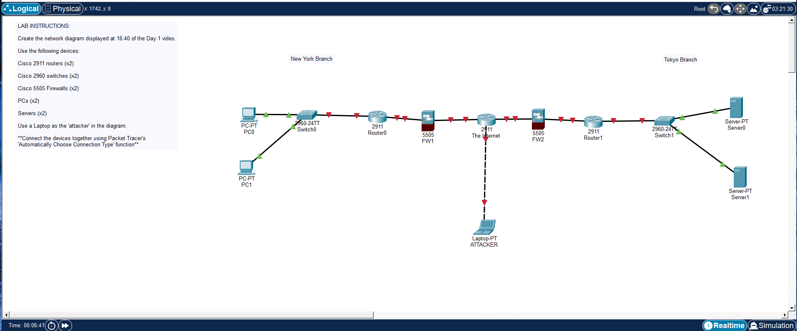

# Day 01 Lab - Packet Tracer Introduction

## Overview

This lab introduces the Cisco Packet Tracer environment and walks through building a very basic network topology from scratch. The focus is on becoming comfortable with the interface and understanding how network devices are placed and connected.

## Key Activities

* Installing and launching Cisco Packet Tracer
* Adding devices to the workspace:

  * Router
  * Switch
  * PCs
  * Firewalls
* Connecting devices
* Exploring **Real-Time** vs **Simulation** mode

Source: https://www.youtube.com/watch?v=a1Im6GYaSno&list=PLxbwE86jKRgMpuZuLBivzlM8s2Dk5lXBQ&index=3