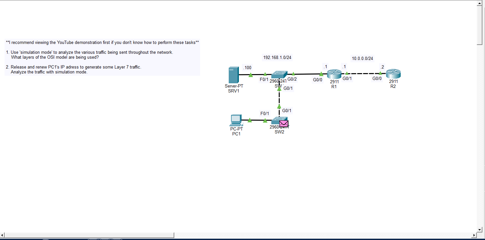
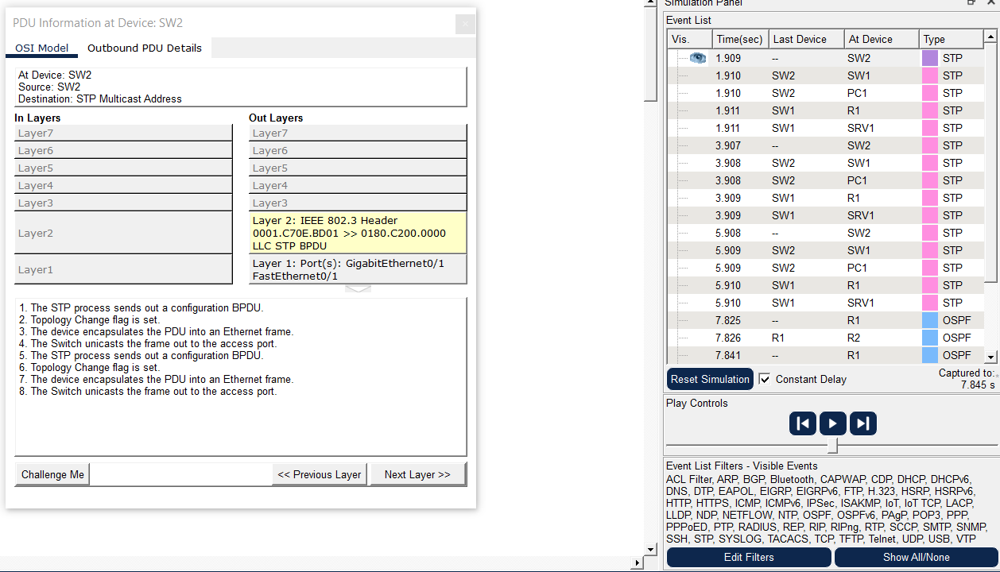
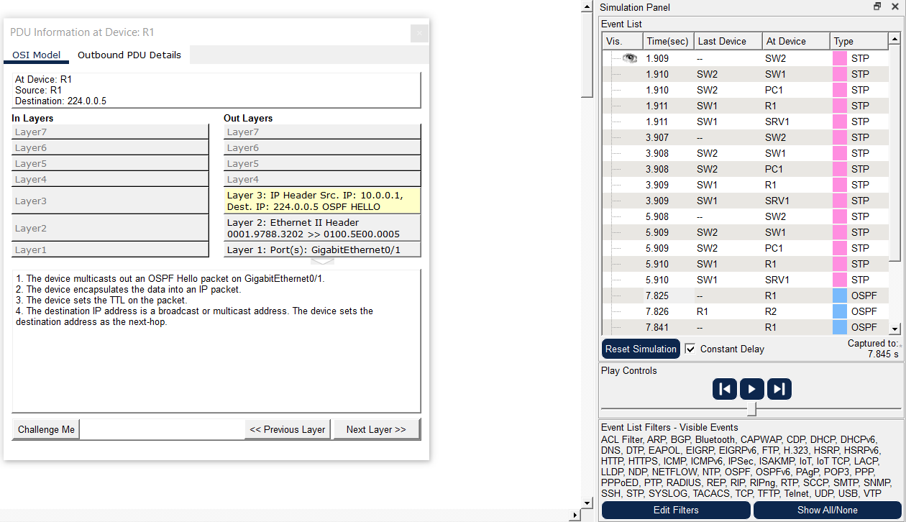
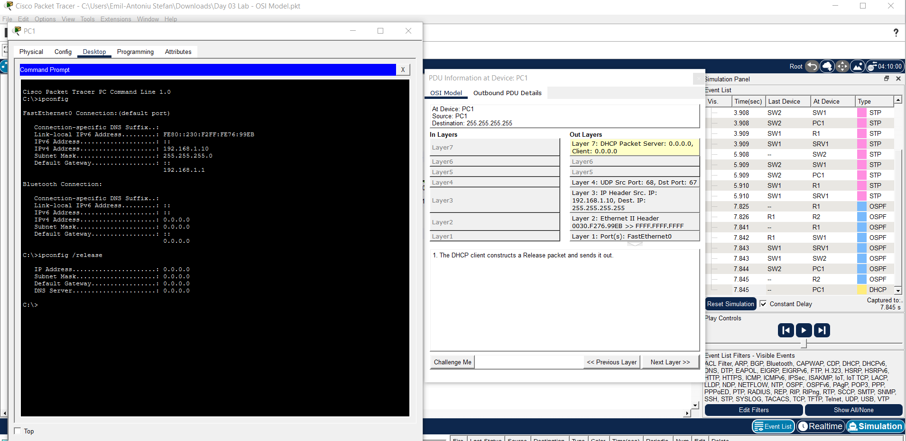

# Day 3 Lab 

## Overview
This lab is a lesson on the **OSI Model**. In this lab, Packet Tracer’s **Simulation Mode** is used to observe network traffic and map protocols to OSI layers.

## Key Activities
- Examine captured packets and identify **OSI layer headers**:  
  - Identify Layer 2 fields like source/destination MAC.
  - Identify Layer 3 fields such as IP addresses.
  - Identify Layer 4 fields such as ports.
  - Observe higher-level protocol information (e.g., DHCP as a Layer 7 process) while noting how intermediate layers encapsulate from the top-down (Layer 7 to Layer 1).
- Discuss how protocols like OSPF operate at Layer 3 and how STP functions at Layer 2 to prevent loops.

   
   
   
   

Source: https://www.youtube.com/watch?v=7nmYoL0t2tU&list=PLxbwE86jKRgMpuZuLBivzlM8s2Dk5lXBQ&index=7