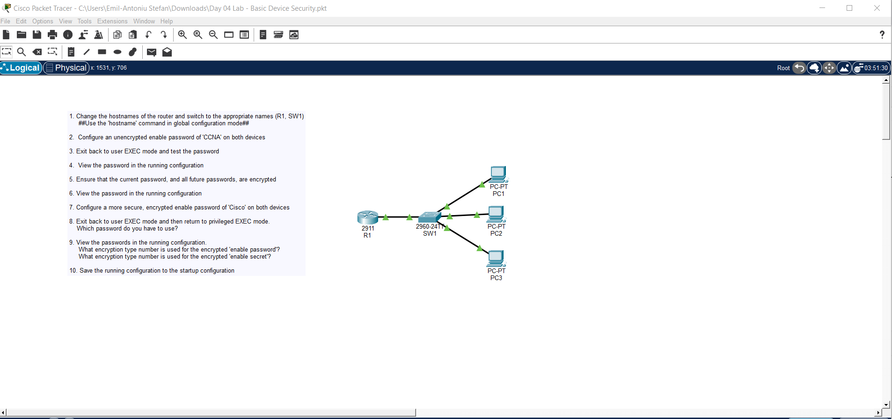
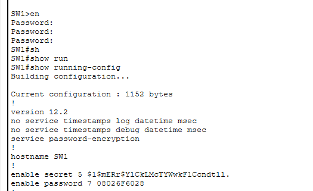

# Day 4 Lab

## Overview
This lab covers **Basic Device Security** in Cisco IOS.
## Key Activities
- Access devices in Packet Tracer and use the **CLI** to connect to routers and switches via the console.
- Enter **privileged EXEC mode** and then **global configuration mode** to start configuring the devices.
- Set hostnames on devices for easier identification. 
- Configure an **unencrypted enable password** to protect privileged EXEC mode access.
- Use IOS to **encrypt all device passwords** using service-level encryption.
- Replace the unencrypted password with a **more secure enable secret** password.
- View and verify configurations using “show” commands.
- Save the running configuration to startup configuration to retain settings across reloads.

## Commands to remember
- `enable` - Enter **privileged EXEC mode** from user EXEC mode.  
- `configure terminal` - Enter **global configuration mode**.  
- `hostname <name>` - Sets a hostname.
- `enable password <password>` - Set an **unencrypted** password for privileged EXEC mode. Can be seen in the running-config. 
- `service password-encryption` - Encrypt all plaintext passwords in the running configuration.  
- `enable secret <password>` - Set a **secure (encrypted)** password for privileged EXEC mode. Cannot be seen in the running-config due to encryption.
- `show running-config` - Display the device’s **active configuration**.  
- `show startup-config` - Display the configuration saved to **NVRAM**.  
- `copy running-config startup-config` (or `write memory`) - **Save** the current configuration.  

   

Source: https://www.youtube.com/watch?v=SDocmq1c05s&list=PLxbwE86jKRgMpuZuLBivzlM8s2Dk5lXBQ&index=9