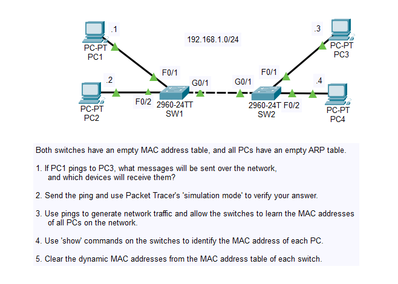
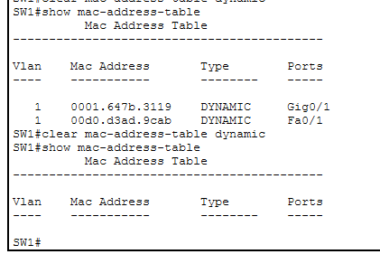
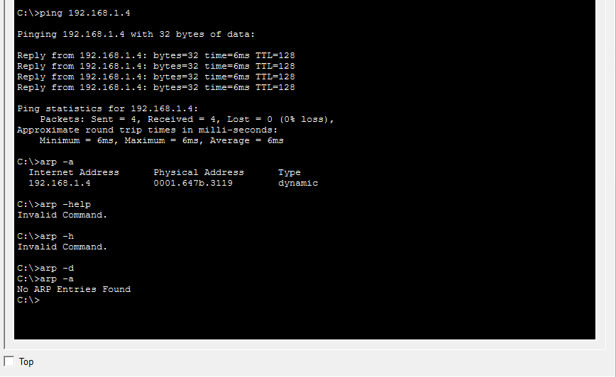
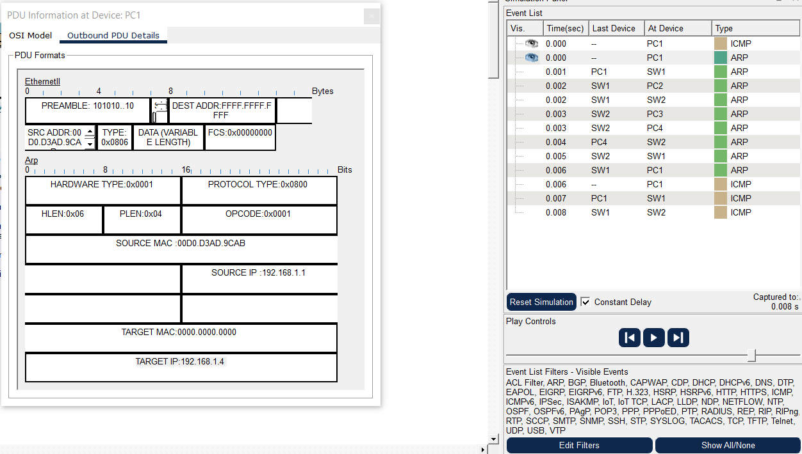

# Day 6 Lab

## Overview
This lab focuses on **Ethernet LAN switching behavior**, reinforcing key Layer 2 concepts such as ARP, MAC address learning, and frame forwarding/flooding. It shows how switches populate MAC address tables and how devices communicate before ping traffic flows.

## Key Activities
- Use **Simulation Mode** to step through the ARP process. When a PC tries to reach another (e.g. through a ping), the following happens:
    - ARP Request (flooded by the switch to all other PCs - broadcast frame)
    - ARP Reply (the sender learns the MAC address - unicast frame)
    - ICMP Echo Request (received by the intended recipient only - unicast frame)
    - ICMP Echo Reply (received by the sender - unicast frame)
- Notice that not only do switches build a mac address table, but so do PCs build their ARP table.

- Notice key fields within the frame, such as TYPE (0x0806 indicating ARP, 0x0800 indicating ICMP), SOURCE & DESTINATION (good for identifying the broadcast frame)
- Notice how the ARP Layer 3 data gets encapsulated into the Layer 2 frame.

## Commands to remember
- `show mac address-table` - Display the switch’s learned MAC addresses and associated ports.  
- `clear mac address-table dynamic` - Remove all dynamic MAC entries.

Source: https://www.youtube.com/watch?v=Ig0dSaOQDI8&list=PLxbwE86jKRgMpuZuLBivzlM8s2Dk5lXBQ&index=12