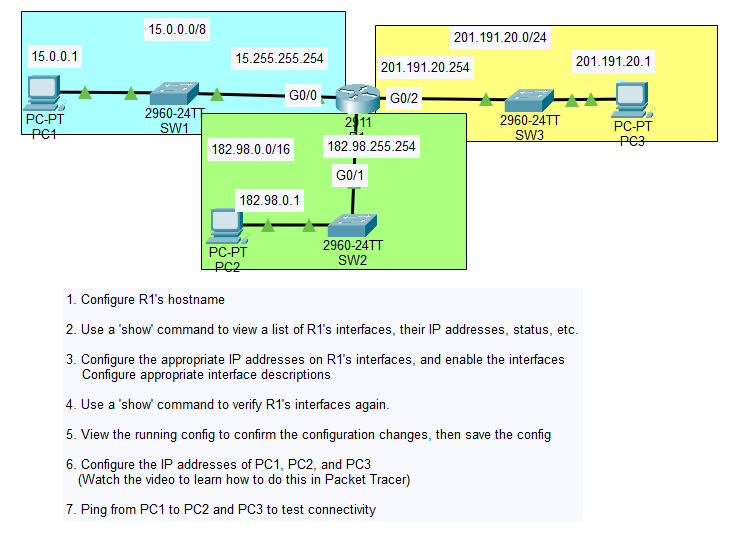
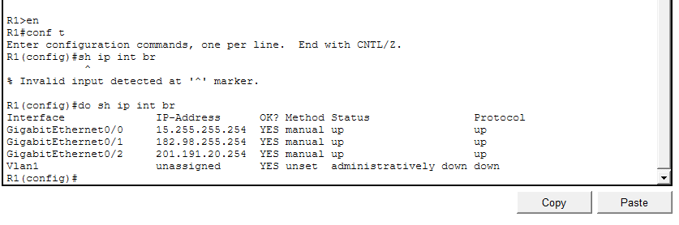
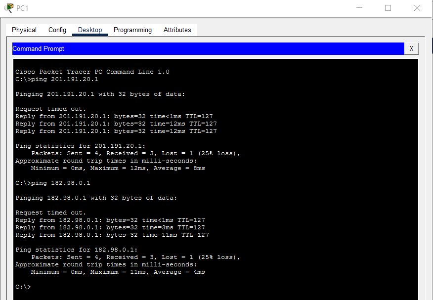

# Day 8 Lab

## Overview
This lab covers **Configuring IP Addresses**. The focus is on proper addressing, subnet masks, gateways, and verifying connectivity.

## Key Activities
- Enter global configuration mode on routers to assign IPv4 addresses to interfaces.
- Assign subnet masks to match the addressing plan.
- Configure gateway addresses on PC network settings to match router interfaces.
- Use basic verification commands (e.g., `show ip interface brief`) to confirm address assignments.
- Test end-to-end connectivity using **ping** between devices.

## Commands to remember
- `interface <type><slot/port>` - Enter interface configuration mode on routers/switches.  
- `ip address <address> <mask>` - Assign an IPv4 address and subnet mask to an interface.  
- `no shutdown` - Enable the interface.  
- `show ip interface brief` - Verify interface IP addresses and status.  

Source: https://www.youtube.com/watch?v=e1jbvyMeS5I&list=PLxbwE86jKRgMpuZuLBivzlM8s2Dk5lXBQ&index=15