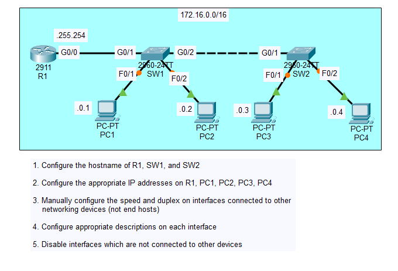
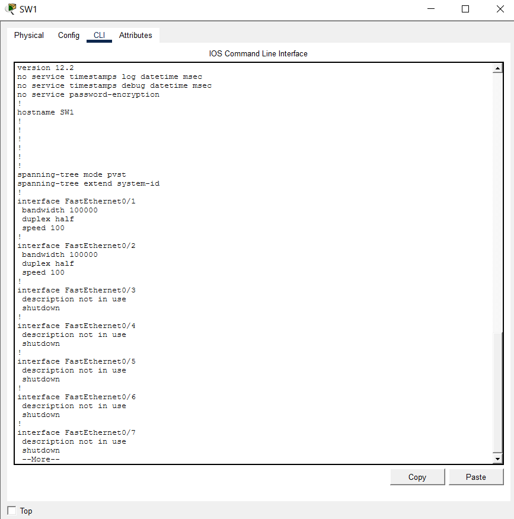

# Day 9 Lab

## Overview
This lab walks through configuring **interfaces** on Cisco devices in Packet Tracer. We assign IP addresses, enable interfaces, and verify interface states and reachability between routers and hosts.

## Key Activities 
- Assign the correct **IP address**, **subnet mask**, **speed** and **duplex** mode to each interface.   
- Use `show ip interface brief` and `show running-config` to confirm interface configurations.  
- Test connectivity between devices with `ping`.

## Commands to remember
The `speed` command manually sets the interface bandwidth.

- `10` → 10 Mbps  
- `100` → 100 Mbps  
- `1000` → 1 Gbps  
- `auto` → Enables auto-negotiation (default on most interfaces)

 

The `duplex` command manually sets the transmission mode.

- `half` → Can send OR receive at one time (Used in old hub-based networks; allows collisions)  
- `full` → Can send AND receive simultaneously (Modern standard; no collisions)  
- `auto` → Enables auto-negotiation (default)

Source: https://www.youtube.com/watch?v=rzDb5DoBKRk&list=PLxbwE86jKRgMpuZuLBivzlM8s2Dk5lXBQ&index=17