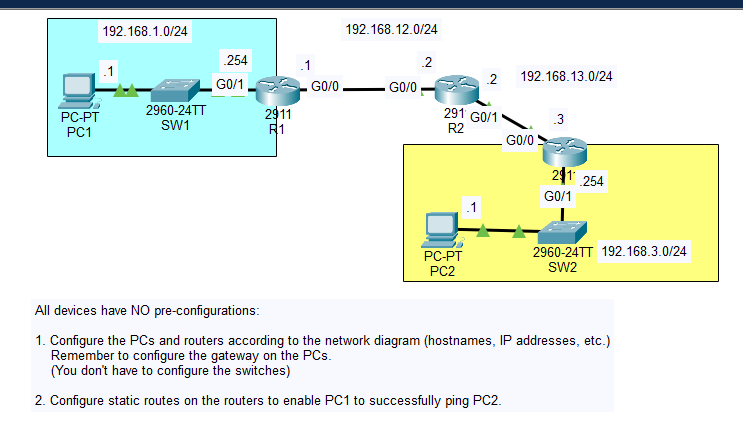
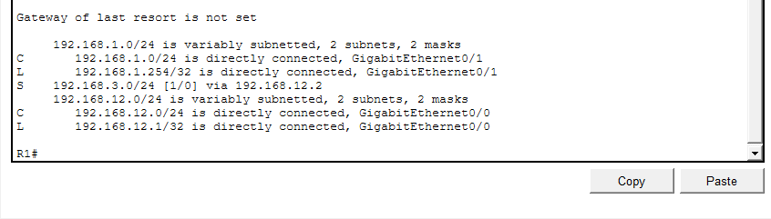
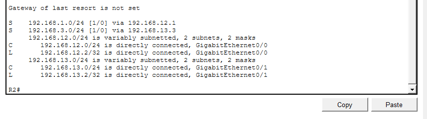
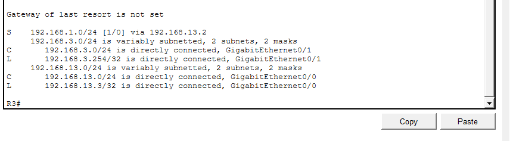
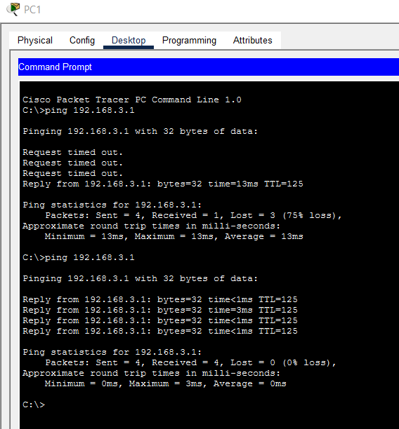
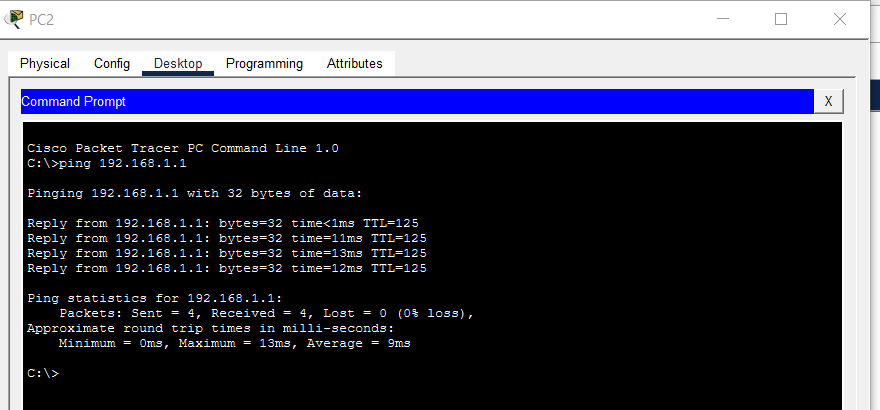

# Day 11 Lab 1

## Overview
This lab focuses on configuring **static routes** on Cisco routers.

## Key Activities
- Configure the **IP address and subnet mask** on each PC and set the **default gateway** pointing to the local router interface. 
- Examine the router **routing table** to observe automatically generated routes:
  - **Connected routes (C)** – networks directly attached to the router
  - **Local routes (L)** – the router’s own interface IP addresses. :contentReference[oaicite:3]{index=3}
- Configure **static routes** so routers know how to reach remote networks.
- After static routes are added on all routers, test connectivity using **ping** between hosts to confirm successful routing.

## Commands to remember
- `show ip route` - Display the router’s routing table and verify routes.
- `ip route <destination-network> <mask> <next-hop-ip>` - Create a **static route** to reach a remote network via the next-hop router.

Source:
https://www.youtube.com/watch?v=XHxOtIav2k8&list=PLxbwE86jKRgMpuZuLBivzlM8s2Dk5lXBQ&index=21
https://www.youtube.com/watch?v=3z8YGEVFTiA&list=PLxbwE86jKRgMpuZuLBivzlM8s2Dk5lXBQ&index=22&pp=iAQB