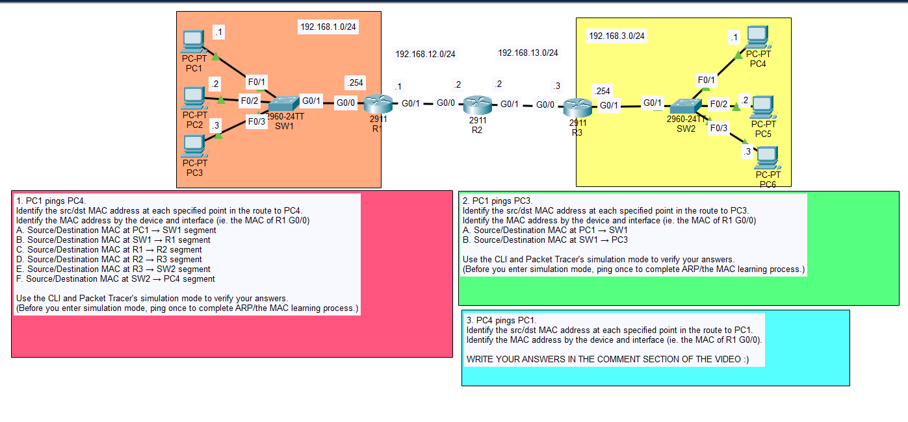
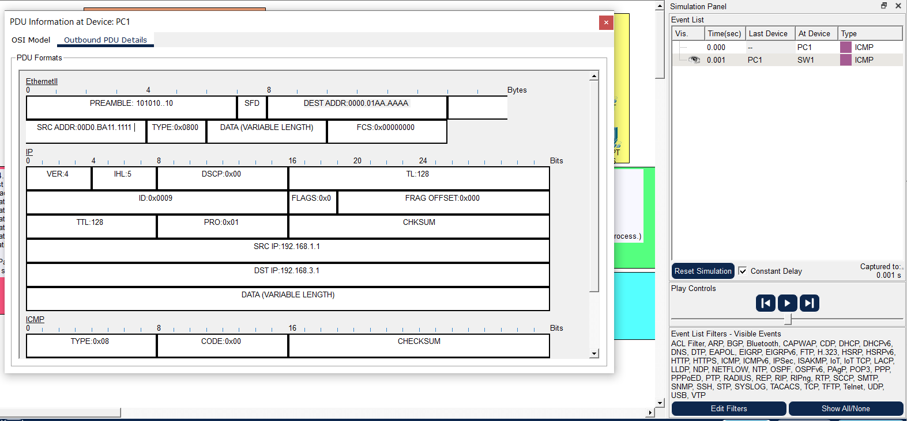
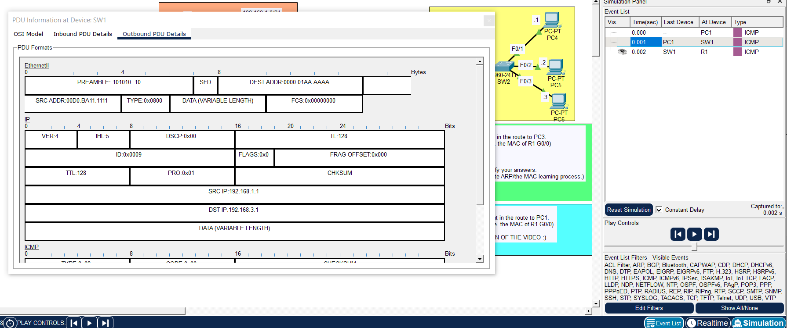
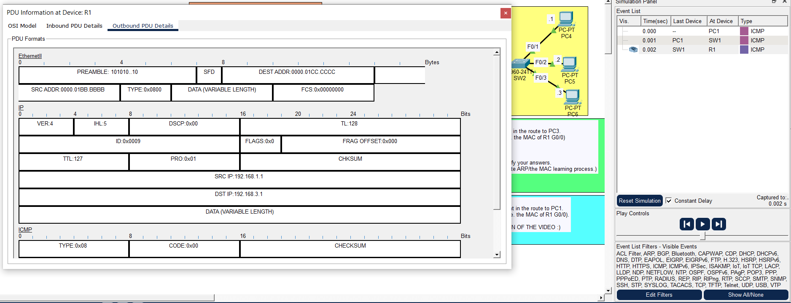
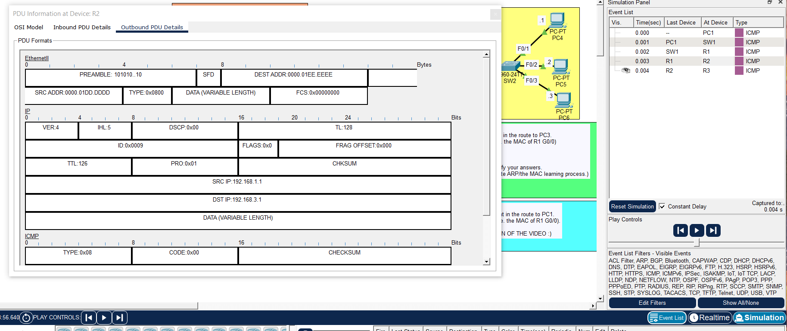
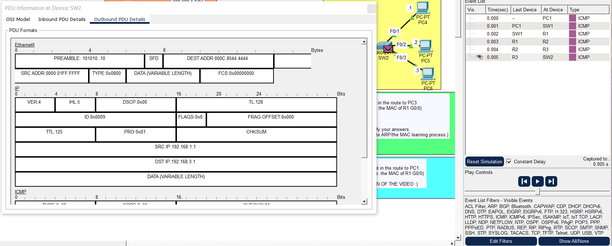
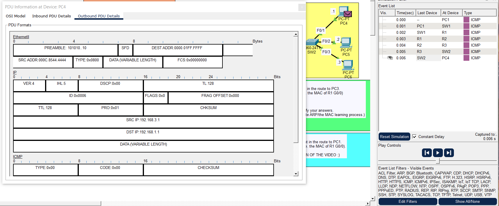

# Day 12 Lab

## Overview
This lab uses **Packet Tracer Simulation Mode** to analyze the complete **life of a packet** as it travels across multiple networks.

## Key Activities
- Observe how the PC encapsulates the packet in an **Ethernet frame addressed to the default gateway**.
- Follow the frame as it moves through the network:
  - Switches **forward frames using MAC addresses**.
  - Routers **de-encapsulate the frame**, inspect the **IP header**, and make a routing decision.
- After the routing decision, observe the router:
  - Re-encapsulate the packet with **new source and destination MAC addresses** for the next hop.

## Commands to remember

- `show arp` - Display the ARP table mapping IP addresses to MAC addresses.

Source: https://www.youtube.com/watch?v=bfsEqDeHbpI&list=PLxbwE86jKRgMpuZuLBivzlM8s2Dk5lXBQ&index=24