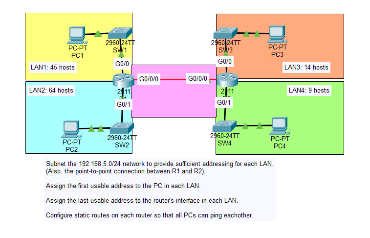
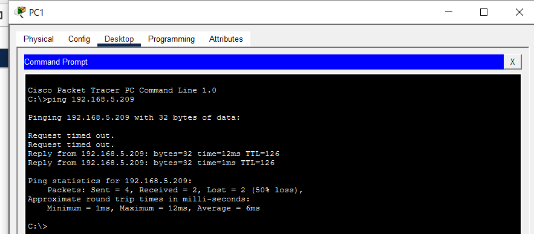

# Day 15 Lab

## Overview
This lab practices **Variable Length Subnet Masking (VLSM)** to divide a single network into multiple subnets of different sizes based on host requirements.

## Key Activities
- Review the network topology and determine the **host requirements** for each LAN.
- Sort networks **from largest to smallest host requirement** before subnetting.
- Calculate the **minimum subnet size** needed for each LAN.
- Allocate subnets sequentially from the base network while avoiding overlap.
- Assign:
  - **First usable address → PCs**
  - **Last usable address → Router interface**
- Verify connectivity between hosts after the addressing plan is implemented.

| Hosts Needed | Minimum Hosts | Subnet | Usable Hosts |
| ------------ | ------------- | ------ | ------------ |
| 64           | 64+2          | /25    | 126          |
| 45           | 45+2          | /26    | 62           |
| 14           | 14+2          | /28    | 14           |
| 9            | 9+2           | /28    | 14           |

| LAN             | Subnet           | Usable Range                  | Broadcast     |
| --------------- | ---------------- | ----------------------------- | ------------- |
| LAN1 (64 hosts) | 192.168.5.0/25   | 192.168.5.1 – 192.168.5.126   | 192.168.5.127 |
| LAN2 (45 hosts) | 192.168.5.128/26 | 192.168.5.129 – 192.168.5.190 | 192.168.5.191 |
| LAN3 (14 hosts) | 192.168.5.192/28 | 192.168.5.193 – 192.168.5.206 | 192.168.5.207 |
| LAN4 (9 hosts)  | 192.168.5.208/28 | 192.168.5.209 – 192.168.5.222 | 192.168.5.223 |
| P2P Link (2 hosts)| 192.168.5.224/30 | 192.168.5.225 – 192.168.5.226 | 192.168.5.227 |

Source: https://www.youtube.com/watch?v=Rn_E1Qv8--I&list=PLxbwE86jKRgMpuZuLBivzlM8s2Dk5lXBQ&index=28&pp=iAQB