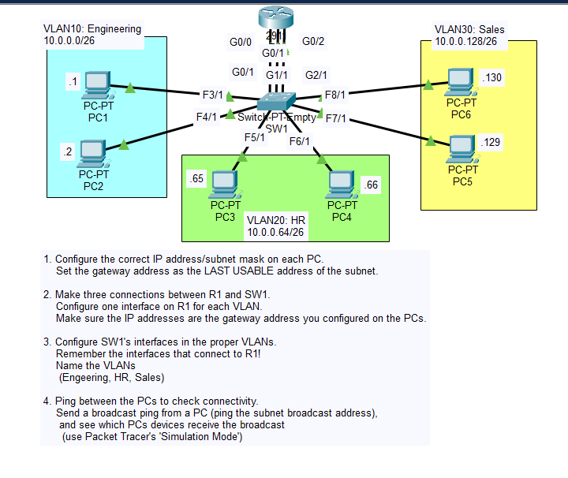

# Day 16 Lab

This lab focuses on creating and configuring **VLANs**.



## Key Activities

- Configure IP addresses and default gateways on PCs.
- Create VLANs on the switch (VLAN 10, 20, and 30).
- Assign switch interfaces to specific VLANs as access ports.
- Verify VLAN configuration using show commands.
- Confirm that devices in the same VLAN can communicate, while devices in different VLANs cannot without routing.


| VLAN ID | Name        | Department  |
|--------|-------------|-------------|
| 10     | ENGINEERING | Engineering |
| 20     | HR          | HR          |
| 30     | SALES       | Sales       |

---

## IP Addressing Plan

| VLAN | Subnet | Mask | Default Gateway |
|-----|--------|------|----------------|
| VLAN10 | 10.0.0.0/26 | 255.255.255.192 | 10.0.0.62 |
| VLAN20 | 10.0.0.64/26 | 255.255.255.192 | 10.0.0.126 |
| VLAN30 | 10.0.0.128/26 | 255.255.255.192 | 10.0.0.190 |

---

## PC Addressing

| PC | VLAN | IP Address | Subnet Mask | Default Gateway |
|----|------|-----------|-------------|----------------|
| PC1 | VLAN10 | 10.0.0.1 | 255.255.255.192 | 10.0.0.62 |
| PC2 | VLAN10 | 10.0.0.2 | 255.255.255.192 | 10.0.0.62 |
| PC3 | VLAN20 | 10.0.0.65 | 255.255.255.192 | 10.0.0.126 |
| PC4 | VLAN20 | 10.0.0.66 | 255.255.255.192 | 10.0.0.126 |
| PC5 | VLAN30 | 10.0.0.129 | 255.255.255.192 | 10.0.0.190 |
| PC6 | VLAN30 | 10.0.0.130 | 255.255.255.192 | 10.0.0.190 |

---

## Commands to remember

Used to create and set identifiers for the VLAN.
- ```vlan NUMBER```  
- ```name NAME```  

Used to configure an interface in access mode and assign it to a VLAN.
- ```switchport mode access``` 
- ```switchport access vlan NUMBER```  

Source: https://www.youtube.com/watch?v=-tq7f3xtyLQ&list=PLxbwE86jKRgMpuZuLBivzlM8s2Dk5lXBQ&index=30