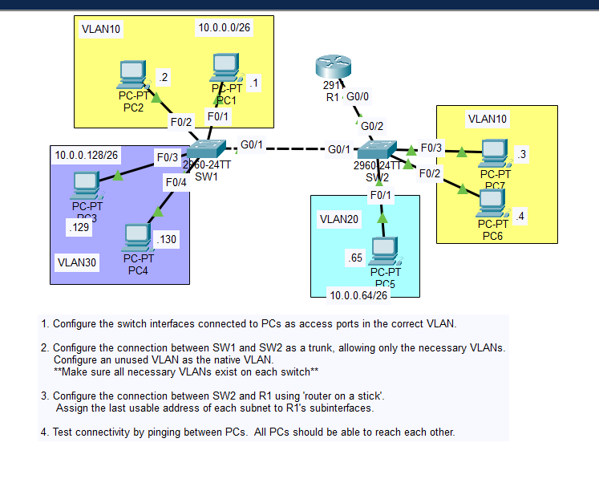
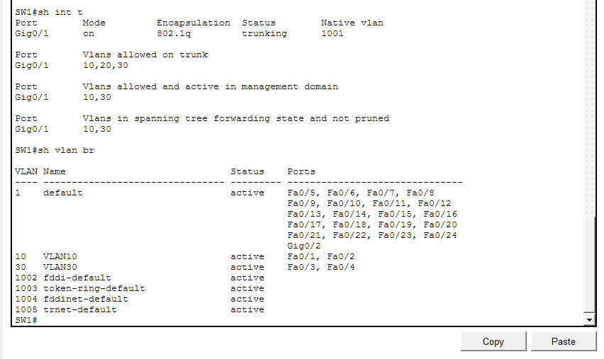
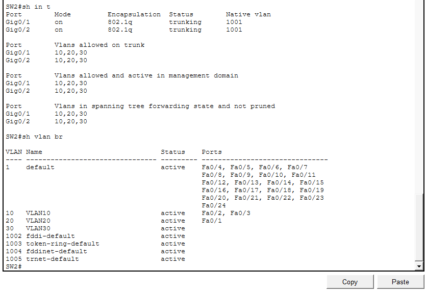

# Day 17 Lab

## Overview
This lab focuses on **VLAN trunking and inter-VLAN routing**.

## Key Activities
- Configure switch interfaces connected to PCs as **access ports** in the correct VLANs.
- Configure the **link between SW1 and SW2 as a trunk port**.

## Commands to remember

switchport mode trunk  
switchport trunk allowed vlan VLAN1,VLAN2  

show vlan brief
show interfaces trunk

Source: https://www.youtube.com/watch?v=iRkFE_lpYgc&list=PLxbwE86jKRgMpuZuLBivzlM8s2Dk5lXBQ&index=32