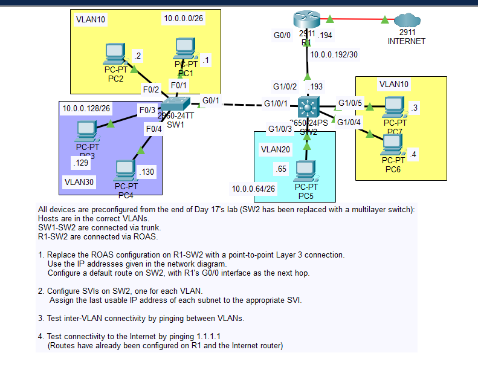
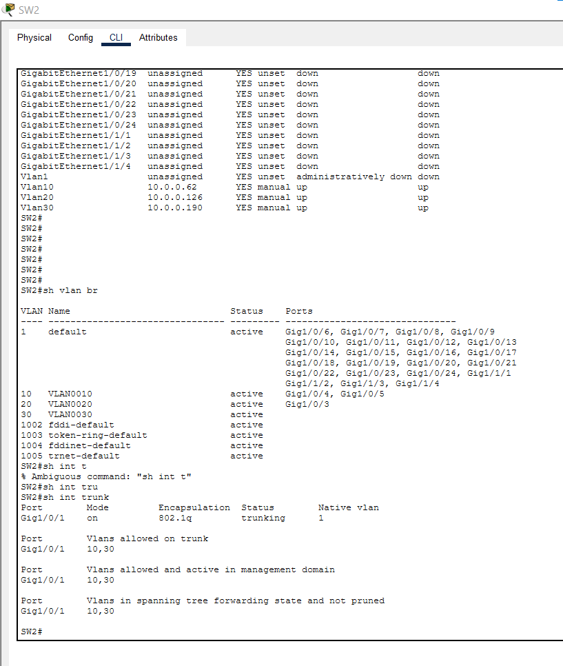

# Day 18 Lab

## Overview
This lab focuses on **inter-VLAN routing using a Layer 3 (multilayer) switch**.

## Key Activities
- Enable **Layer 3 routing** on the multilayer switch.
- Create **SVIs (Switch Virtual Interfaces)** for each VLAN and assign IP addresses.
- Verify inter-VLAN communication by testing connectivity between hosts in different VLANs.

## Commands to remember
On the multilayer switch: 
`ip routing`

interface vlan 10  
ip address 192.168.10.1 255.255.255.0  
no shutdown  

interface vlan 20  
ip address 192.168.20.1 255.255.255.0  
no shutdown  

Source: https://www.youtube.com/watch?v=MQcCr3QW1vE&list=PLxbwE86jKRgMpuZuLBivzlM8s2Dk5lXBQ&index=34