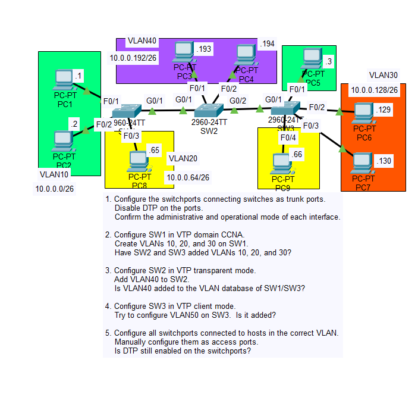
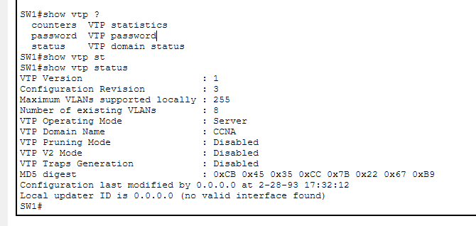
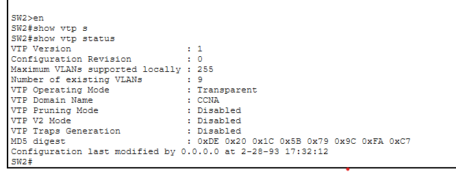
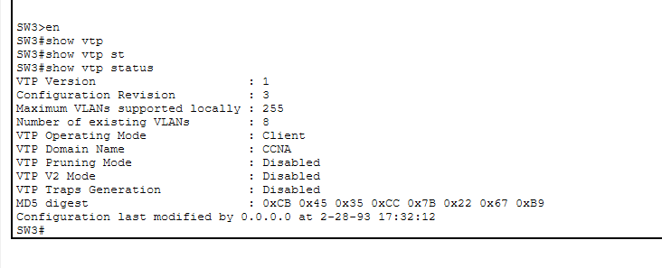

# Day 19 Lab

## Overview
This lab focuses on two Cisco proprietary protocols: **Dynamic Trunking Protocol (DTP)** and **VLAN Trunking Protocol (VTP)**. The goal is to observe how switches can dynamically negotiate trunk links using DTP and how VLAN information can be synchronized across switches in a VTP domain. The lab also demonstrates why these protocols are often disabled in modern networks due to potential security and management risks.

## Key Activities
- Configure trunk links between switches and observe how **DTP automatically negotiates trunk formation**.
- Experiment with different **DTP interface modes** such as dynamic desirable and dynamic auto.
- Disable DTP negotiation on trunk ports to enforce manual trunk configuration.
- Configure a **VTP domain** and observe how switches automatically join the domain when receiving advertisements.
- Configure a switch as a **VTP server** and create a VLAN.
- Observe how the VLAN database automatically synchronizes to other switches configured as **VTP clients**.
- Examine how **VTP revision numbers** increase when VLAN changes occur.
- Verify VLAN synchronization across switches using show commands.
- Observe the potential danger of VTP where a switch with a higher revision number could overwrite the VLAN database of other switches in the domain.

## Commands to remember

`interface` INTERFACE 
`switchport mode dynamic` `desirable`/`auto` 
`switchport nonegotiate` 

`vtp domain` DOMAIN  
`vtp mode` `server`/`client`/`transparent` 

`show vtp status` 
`show interfaces switchport`

Source: https://www.youtube.com/watch?v=ngTns2vF_44&list=PLxbwE86jKRgMpuZuLBivzlM8s2Dk5lXBQ&index=36