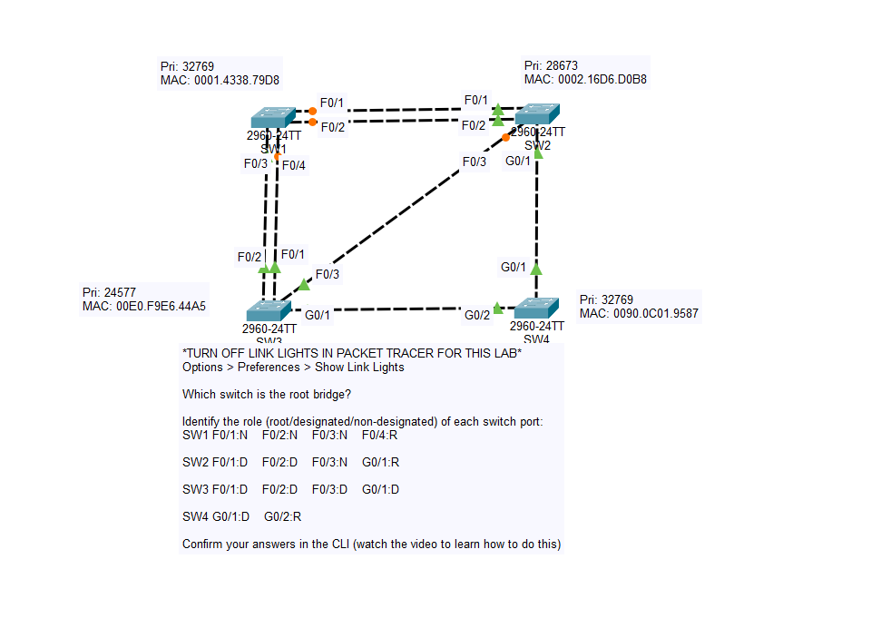
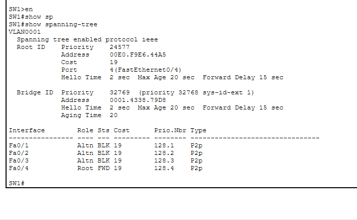
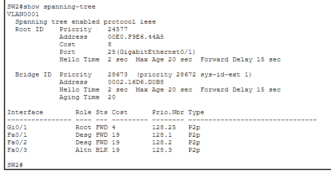
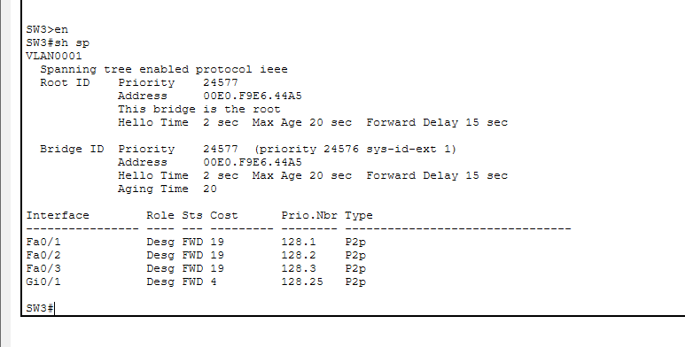
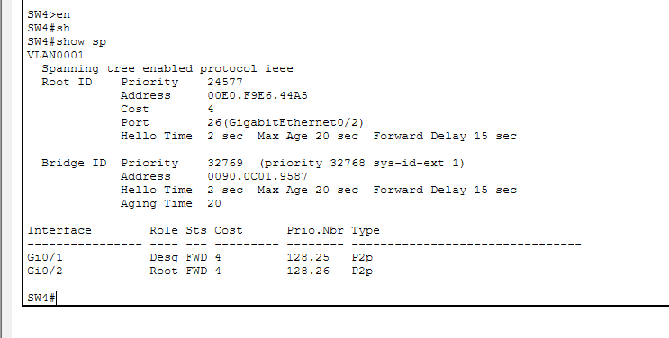

# Day 20 Lab

## Overview
This lab focuses on **analyzing Spanning Tree Protocol (STP)** behavior in a switched network.

## Key Activities
- Examine the network topology and calculate which switch becomes the **root bridge** by comparing bridge priorities and MAC addresses.
- Identify the **root ports** on non-root switches by determining which interface provides the lowest path cost to the root bridge.
- Determine the **designated port** for each network segment (the port that forwards traffic toward the root).
- Identify any **non-designated ports** that are placed in a blocking state to prevent Layer 2 loops.
- Observe STP output fields such as **Root ID**, **Bridge ID**, port roles, port states, and path costs.

## STP Tie-Breakers

When multiple possible paths exist in a Layer 2 network, **Spanning Tree Protocol (STP)** uses a series of tie-breakers to determine the best path and prevent loops.

### 1. Root Bridge Election
The switch with the **lowest Bridge ID (BID)** becomes the root bridge.

Bridge ID components (compared in order):
1. **Bridge Priority** (default 32768)
2. **MAC Address**

Lowest value wins.

---

### 2. Root Port Selection (on non-root switches)

Each switch selects **one Root Port**, which is the port with the best path to the root bridge.

Tie-breaker order:

1. **Lowest Root Path Cost**
2. **Lowest Sender Bridge ID**
3. **Lowest Sender Port ID**

---

### 3. Designated Port Selection (per network segment)

Each segment elects one **Designated Port** responsible for forwarding traffic toward the root bridge.

Tie-breaker order:

1. **Lowest Root Path Cost**
2. **Lowest Bridge ID**
3. **Lowest Port ID**

## Commands to remember

`show spanning-tree detail`/`summary`

Source: https://www.youtube.com/watch?v=Ev9gy7B5hx0&list=PLxbwE86jKRgMpuZuLBivzlM8s2Dk5lXBQ&index=38