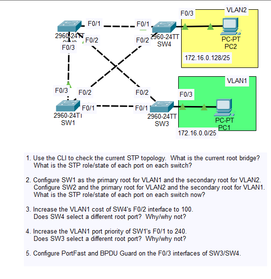

# Day 21 Lab

## Overview
This lab focuses on **configuring Spanning Tree Protocol using PVST+ (Per-VLAN Spanning Tree Plus)** on Cisco switches. The goal is to influence the STP topology by manually selecting the **root bridge** for specific VLANs and verifying how STP recalculates port roles and forwarding paths. PVST+ allows each VLAN to maintain its own spanning tree instance, enabling better load balancing and control of Layer 2 traffic paths.

## Key Activities
- Analyze the existing switched topology to determine the current **root bridge** for each VLAN.
- Modify switch configuration to influence which switch becomes the **root bridge**.
- Configure a switch to become the **primary root bridge** for a VLAN.
- Configure another switch as the **secondary root bridge** for redundancy.
- Observe how STP recalculates **root ports, designated ports, and blocking ports** after configuration changes.

## Commands to remember

`spanning-tree vlan` NUMBER `root primary`/`secondary`
`spanning-tree vlan` NUMBER `priority` 4096

Source: https://www.youtube.com/watch?v=5rpaeJNig2o&list=PLxbwE86jKRgMpuZuLBivzlM8s2Dk5lXBQ&index=44