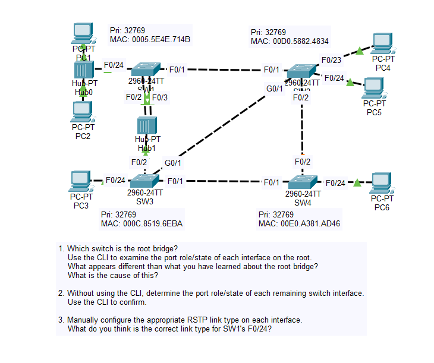

# Day 22 Lab

## Overview
This lab focuses on **Rapid Spanning Tree Protocol (RSTP)** and Cisco’s implementation **Rapid PVST+**. RSTP improves convergence time compared to classic STP, allowing the network to react to topology changes in only a few seconds instead of up to 50 seconds.

## Key Improvements:

- **Faster convergence**  
  RSTP typically converges in **1–6 seconds**, whereas classic STP can take **30–50 seconds** due to listening and learning timers.

- **New port roles**  
  RSTP introduces **alternate** and **backup** ports to provide immediate failover paths.

- **Simplified port states**  
  STP uses 5 states:  
  `Blocking → Listening → Learning → Forwarding → Disabled`  

  RSTP simplifies them to 3 states:  
  `Discarding → Learning → Forwarding`

- **Rapid transition for edge ports**  
  Ports connected to end devices can move to forwarding **immediately**, similar to STP’s PortFast behavior.

- **Proposal/Agreement mechanism**  
  Switches coordinate directly with neighbors to rapidly transition links to forwarding without waiting for timers.

## Commands to remember

`spanning-tree mode rapid-pvst`  

Source: https://www.youtube.com/watch?v=YG7r4XHy2JU&list=PLxbwE86jKRgMpuZuLBivzlM8s2Dk5lXBQ&index=46