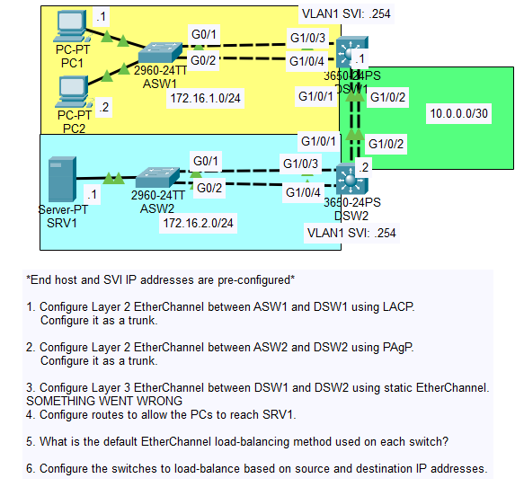

# Day 23 Lab

## Overview
This lab focuses on configuring **EtherChannel**, which allows multiple physical switch interfaces to be bundled into a single logical interface to increase bandwidth and provide redundancy. In this lab, EtherChannel is configured using three methods: **PAgP (Port Aggregation Protocol)**, **LACP (Link Aggregation Control Protocol)**, and **static EtherChannel**. The goal is to configure EtherChannel links between switches and verify that the bundled interfaces operate as a single logical connection.

## Key Activities
- Configure multiple switch interfaces that will participate in an EtherChannel bundle.
- Ensure EtherChannel requirements are met (matching **speed, duplex, VLAN configuration, and trunk/access mode**).
- Observe how multiple physical interfaces combine into a **Port-channel logical interface**.

## Commands to remember
`interface range` g0/1 - 2  
`channel-group` NUMBER `mode` `desirable`/`active`/`on`

`interface port-channel` NUMBER 
`switchport mode trunk ` 

`show etherchannel summary`/`port-channel`/`load-balance`

Source: https://www.youtube.com/watch?v=8gKF2fMMjA8&list=PLxbwE86jKRgMpuZuLBivzlM8s2Dk5lXBQ&index=48