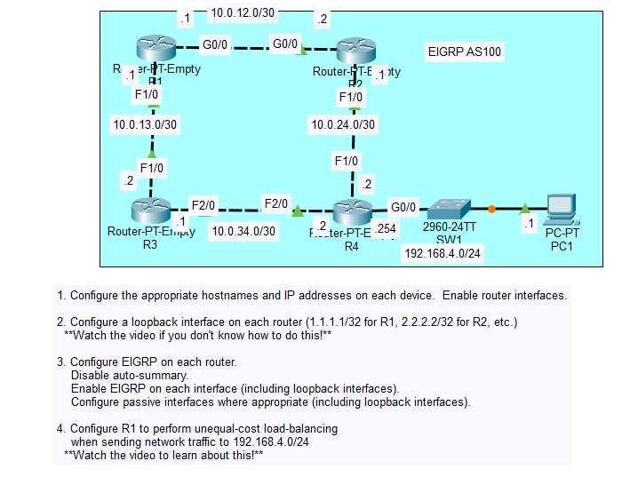
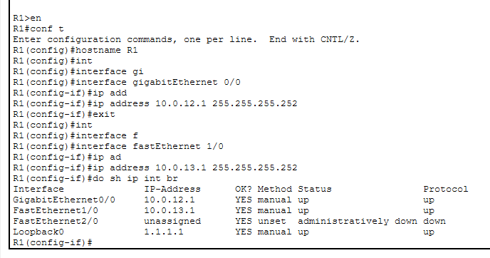
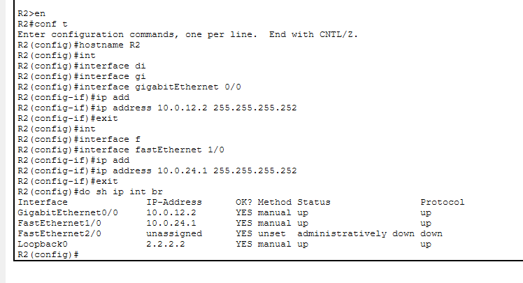
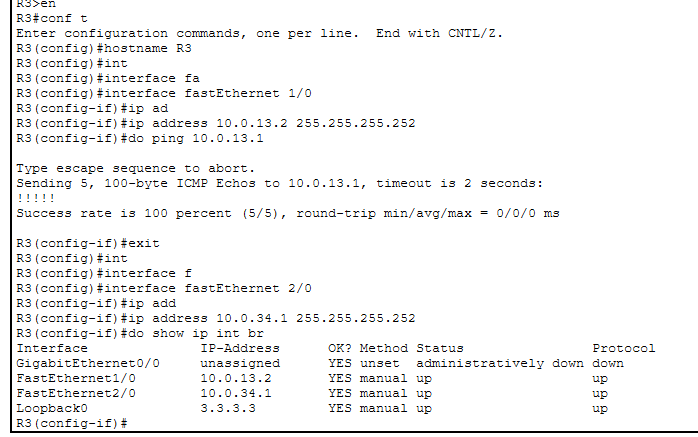
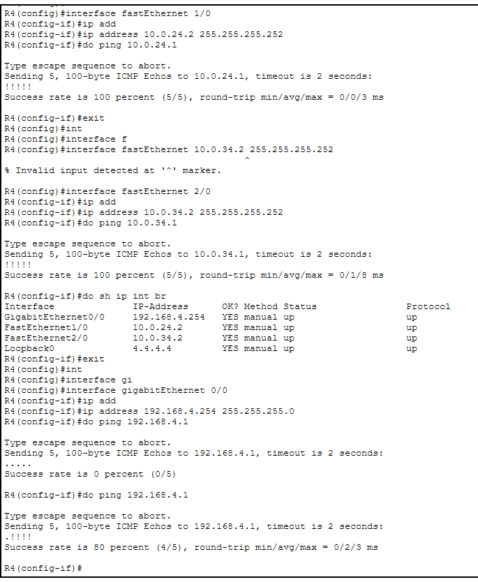
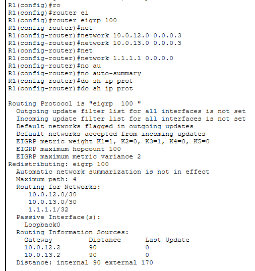
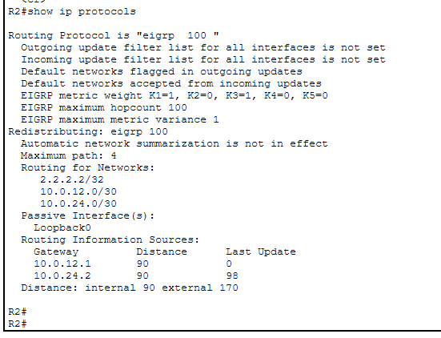
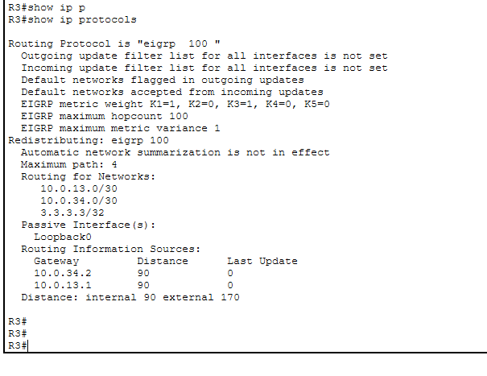
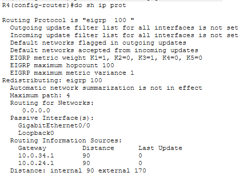
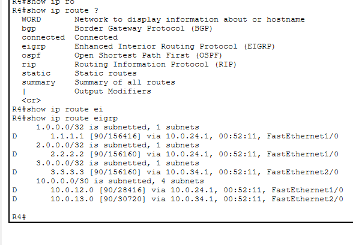

# Day 25 Lab

## Overview
This lab walks us through configuring EIGRP.



## Key Activities
- Configure all routers within the same Autonomous System.
- Configure loopbacks as a best practice. Dynamic routing protocols require routers to have IDs, and the ID can stay consistent by configuring a loopback IP, as it will automatically get chosen as the ID over other interface IPs, even if the physical interfaces go down (loopback is logical).
- Understand that, by default, EIGRP performs equal-cost load-balancing, and that the `variance` metric allows leeway for computing alternative routes.

## Configurations
### Step 1 - Static IPs
```R1
R1(config)#hostname R1

R1(config)#interface gigabitEthernet 0/0
R1(config-if)#ip address 10.0.12.1 255.255.255.252

R1(config)#interface fastEthernet 1/0
R1(config-if)#ip address 10.0.13.1 255.255.255.252
```


```R2
R2(config)#hostname R2

R2(config)#interface gigabitEthernet 0/0
R2(config-if)#ip address 10.0.12.2 255.255.255.252

R2(config)#interface fastEthernet 1/0
R2(config-if)#ip address 10.0.24.1 255.255.255.252
```


```R3
R3(config)#hostname R3

R3(config)#interface fastEthernet 1/0
R3(config-if)#ip address 10.0.13.2 255.255.255.252

R3(config)#interface fastEthernet 2/0
R3(config-if)#ip address 10.0.34.1 255.255.255.252
```


```R4
R4(config)#hostname R4

R4(config)#interface fastEthernet 1/0
R4(config-if)#ip address 10.0.24.2 255.255.255.252

R4(config)#interface fastEthernet 2/0
R4(config-if)#ip address 10.0.34.2 255.255.255.252

R4(config)#interface gigabitEthernet 0/0
R4(config-if)#ip address 192.168.4.254 255.255.255.0
```


### Step 2 - Loopback interfaces
```R1
R1(config)#interface loopback 0
R1(config-if)#ip address 1.1.1.1 255.255.255.255
```

```R2
R2(config)#interface loopback 0
R2(config-if)#ip address 2.2.2.2 255.255.255.255
```

```R3
R3(config)#interface loopback 0
R3(config-if)#ip address 3.3.3.3 255.255.255.255
```

```R4
R4(config)#interface loopback 0
R4(config-if)#ip address 4.4.4.4 255.255.255.255
```

### Step 3 - Configure EIGRP
```R1
R1(config)#router eigrp 100

R1(config-router)#network 10.0.12.0 0.0.0.3
R1(config-router)#network 10.0.13.0 0.0.0.3
R1(config-router)#network 1.1.1.1 0.0.0.0

R1(config-router)#passive-interface loopback 0

R1(config-router)#no auto-summary 
```


```R2
R2(config)#router eigrp 100

R2(config-router)#network 10.0.12.0 0.0.0.3
R2(config-router)#network 10.0.24.0 0.0.0.3
R2(config-router)#network 2.2.2.2 0.0.0.0

R2(config-router)#passive-interface loopback 0

R2(config-router)#no auto-summary 
```


```R3
R3(config)#router eigrp 100

R3(config-router)#network 10.0.13.0 0.0.0.3
R3(config-router)#network 10.0.34.0 0.0.0.3
R3(config-router)#network 3.3.3.3 0.0.0.0

R3(config-router)#passive-interface loopback 0

R3(config-router)#no auto-summary 
```


```R4
R4(config)#router eigrp 100

R4(config-router)#network 10.0.24.0 0.0.0.3
R4(config-router)#network 10.0.34.0 0.0.0.3
R4(config-router)#network 4.4.4.4 0.0.0.0

R4(config-router)#passive-interface loopback 0
R4(config-router)#passive-interface gigabitEthernet 0/0

R4(config-router)#no auto-summary 
```



### Step 4 - Configure unequal-cost load-balancing on R1
```R1
R1(config-router)#variance 2
```

Source: https://www.youtube.com/watch?v=ffnJ5oBIObY&list=PLxbwE86jKRgMpuZuLBivzlM8s2Dk5lXBQ&index=52