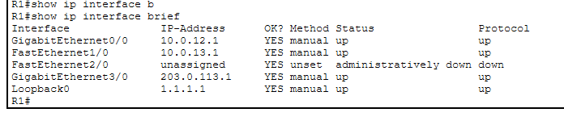
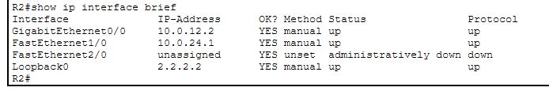
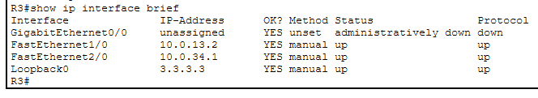
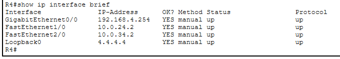

# Day 26 Lab

## Overview

## Key Activities

## Configurations

### Step 1 - Static IPs
```R1
R1(config)#hostname R1

R1(config)#interface gigabitEthernet 0/0
R1(config-if)#ip address 10.0.12.1 255.255.255.252

R1(config)#interface fastEthernet 1/0
R1(config-if)#ip address 10.0.13.1 255.255.255.252

R1(config)#interface gigabitEthernet 3/0
R1(config-if)#ip address 203.0.113.1 255.255.255.252
```


```R2
R2(config)#hostname R2

R2(config)#interface gigabitEthernet 0/0
R2(config-if)#ip address 10.0.12.2 255.255.255.252

R2(config)#interface fastEthernet 1/0
R2(config-if)#ip address 10.0.24.1 255.255.255.252
```

```R3
R3(config)#hostname R3

R3(config)#interface fastEthernet 1/0
R3(config-if)#ip address 10.0.13.2 255.255.255.252

R3(config)#interface fastEthernet 2/0
R3(config-if)#ip address 10.0.34.1 255.255.255.252
```

```R4
R4(config)#hostname R4

R4(config)#interface fastEthernet 1/0
R4(config-if)#ip address 10.0.24.2 255.255.255.252

R4(config)#interface fastEthernet 2/0
R4(config-if)#ip address 10.0.34.2 255.255.255.252

R4(config)#interface gigabitEthernet 0/0
R4(config-if)#ip address 192.168.4.254 255.255.255.0
```


### Step 2 - Loopback interfaces
```R1
R1(config)#interface loopback 0
R1(config-if)#ip address 1.1.1.1 255.255.255.255
```

```R2
R2(config)#interface loopback 0
R2(config-if)#ip address 2.2.2.2 255.255.255.255
```

```R3
R3(config)#interface loopback 0
R3(config-if)#ip address 3.3.3.3 255.255.255.255
```

```R4
R4(config)#interface loopback 0
R4(config-if)#ip address 4.4.4.4 255.255.255.255
```

Source: https://www.youtube.com/watch?v=LeLRWjfylcs&list=PLxbwE86jKRgMpuZuLBivzlM8s2Dk5lXBQ&index=54