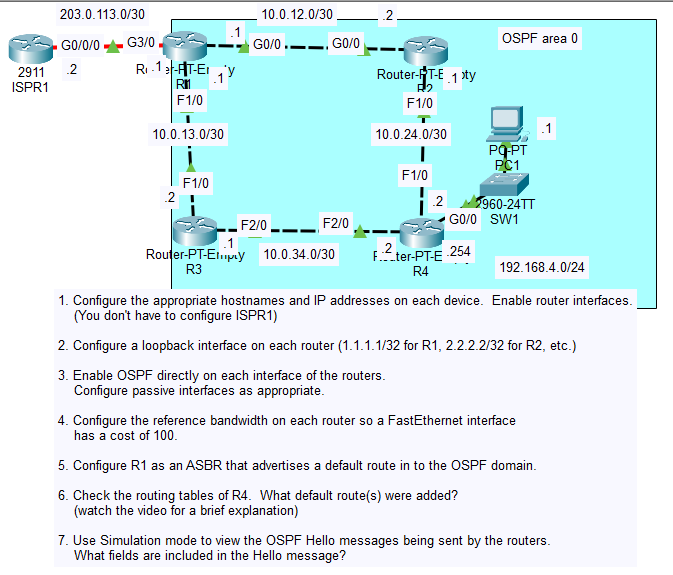
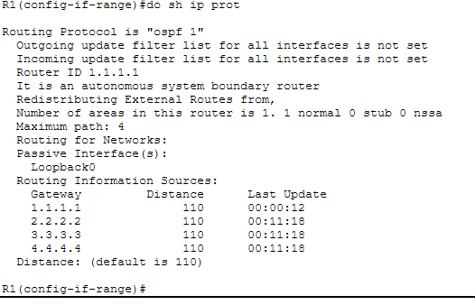
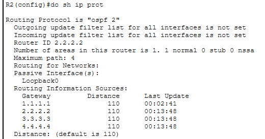
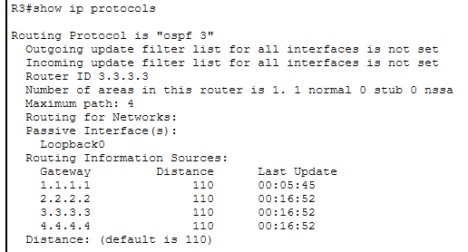
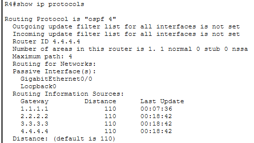
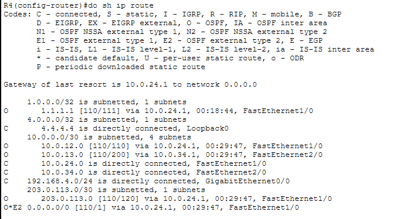
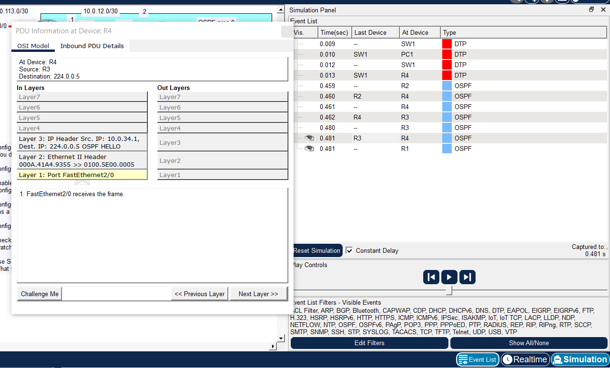
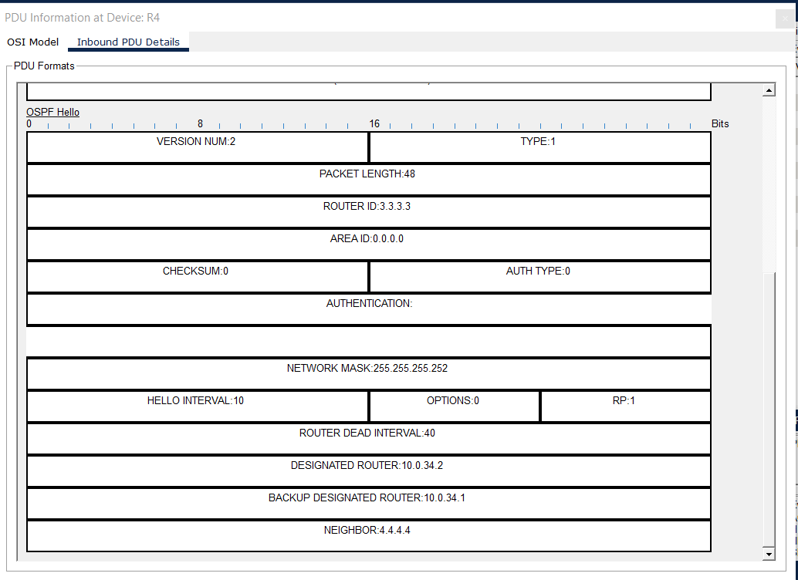

# Day 27 Lab

## Overview

Exploring more OSPF configurations.



## Key Activities

- Observe how OSPF computes the best route, i.e. Cost = Reference bandwidth / Interface bandwidth with a preference for the lowest Cost routes.
- Observe that OSPF Hello packets are multicast to 224.0.0.5
- Identify OSPF packets through packet information, i.e. Protocol number: 89 → identifies OSPF in the IP header.
- Identify OSPF packet type through the **TYPE** field within the OSPF packet (IP packet payload) itself, i.e.

| Type  | Packet Name                       | Purpose                                               |
| ----- | --------------------------------- | ----------------------------------------------------- |
| **1** | Hello                             | Discover neighbors and maintain adjacencies           |
| **2** | Database Description (DBD)        | Exchange summaries of the Link-State Database         |
| **3** | Link-State Request (LSR)          | Request specific LSAs from neighbors                  |
| **4** | Link-State Update (LSU)           | Send requested LSAs or flood new topology information |
| **5** | Link-State Acknowledgment (LSAck) | Confirm receipt of LSAs                               |


## Configurations

### Step 1 - Static IPs
```R1
R1(config)#hostname R1

R1(config)#interface gigabitEthernet 0/0
R1(config-if)#ip address 10.0.12.1 255.255.255.252

R1(config)#interface fastEthernet 1/0
R1(config-if)#ip address 10.0.13.1 255.255.255.252

R1(config)#interface gigabitEthernet 3/0
R1(config-if)#ip address 203.0.113.1 255.255.255.252
```

```R2
R2(config)#hostname R2

R2(config)#interface gigabitEthernet 0/0
R2(config-if)#ip address 10.0.12.2 255.255.255.252

R2(config)#interface fastEthernet 1/0
R2(config-if)#ip address 10.0.24.1 255.255.255.252
```

```R3
R3(config)#hostname R3

R3(config)#interface fastEthernet 1/0
R3(config-if)#ip address 10.0.13.2 255.255.255.252

R3(config)#interface fastEthernet 2/0
R3(config-if)#ip address 10.0.34.1 255.255.255.252
```

```R4
R4(config)#hostname R4

R4(config)#interface fastEthernet 1/0
R4(config-if)#ip address 10.0.24.2 255.255.255.252

R4(config)#interface fastEthernet 2/0
R4(config-if)#ip address 10.0.34.2 255.255.255.252

R4(config)#interface gigabitEthernet 0/0
R4(config-if)#ip address 192.168.4.254 255.255.255.0
```

### Step 2 - Loopback interfaces
```R1
R1(config)#interface loopback 0
R1(config-if)#ip address 1.1.1.1 255.255.255.255
```

```R2
R2(config)#interface loopback 0
R2(config-if)#ip address 2.2.2.2 255.255.255.255
```

```R3
R3(config)#interface loopback 0
R3(config-if)#ip address 3.3.3.3 255.255.255.255
```

```R4
R4(config)#interface loopback 0
R4(config-if)#ip address 4.4.4.4 255.255.255.255
```

### Step 3 - Configure OSPF directly on interfaces
```R1
R1(config)#interface range f1/0, g0/0, l0
R1(config-if-range)#ip ospf 1 area 0

R1(config)#router ospf 1
R1(config-router)#passive-interface loopback 0
```



```R2
R2(config)#interface range f1/0, g0/0, l0
R2(config-if-range)#ip ospf 2 area 0

R2(config)#router ospf 2
R2(config-router)#passive-interface loopback 0
```



```R3
R3(config)#interface range f1/0, f2/0, l0
R3(config-if-range)#ip ospf 3 area 0

R3(config)#router ospf 3
R3(config-router)#passive-interface loopback 0
```



```R4
R4(config)#interface range f1/0, f2/0, g0/0, l0
R4(config-if-range)#ip ospf 4 area 0

R4(config)#router ospf 4
R4(config-router)#passive-interface loopback 0
R4(config-router)#passive-interface gigabitEthernet 0/0
```



### Step 4 - Configure reference bandwith

```R1
R1(config)#router ospf 1
R1(config-router)#auto-cost reference-bandwidth 10000
```

```R2
R2(config)#router ospf 2
R2(config-router)#auto-cost reference-bandwidth 10000
```

```R3
R3(config)#router ospf 3
R3(config-router)#auto-cost reference-bandwidth 10000
```

```R4
R4(config)#router ospf 4
R4(config-router)#auto-cost reference-bandwidth 10000
```

### Step 5 - Configure R1 as ASBR

```R1
R1(config-router)#default-information originate

R1(config)#ip route 0.0.0.0 0.0.0.0 203.0.113.2
```

### Step 6 - R4 Routing Table



### Step 7 - Study OSPF Hello messages




Source: https://www.youtube.com/watch?v=UEyQW-EcnY8&list=PLxbwE86jKRgMpuZuLBivzlM8s2Dk5lXBQ&index=56