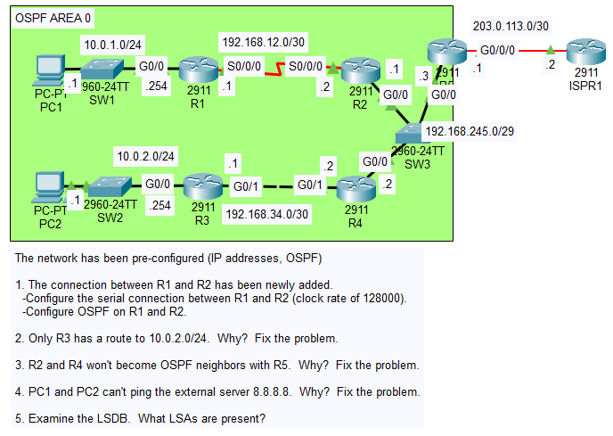
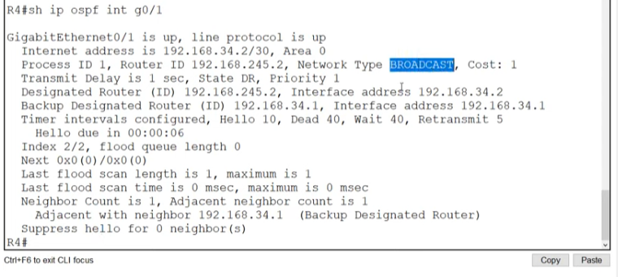
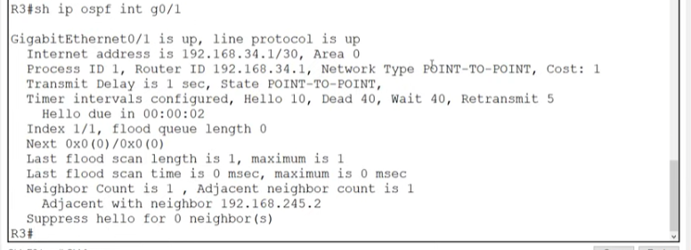
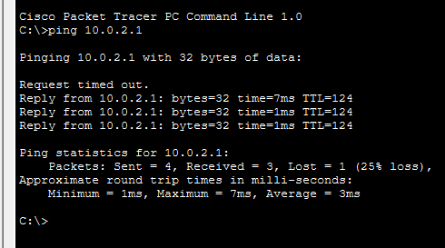
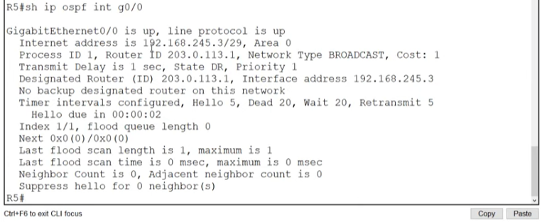
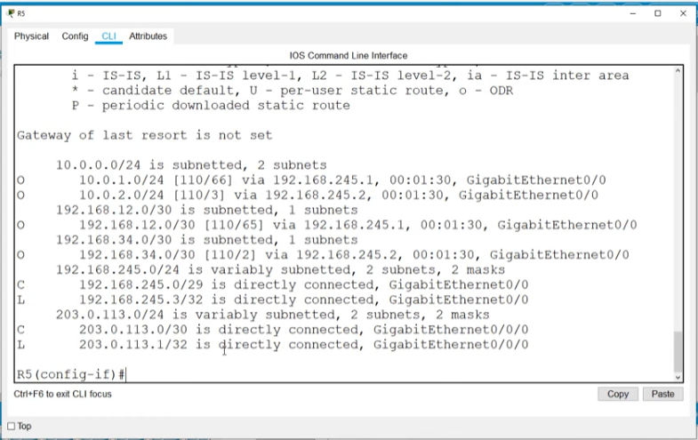
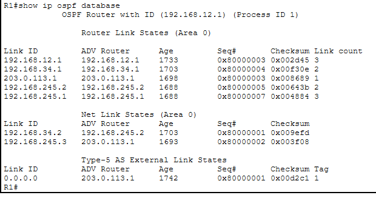

# Day 28 Lab

## Overview

This lab covers basic OSPF troubleshooting.



## Key Activities
- Configure a serial link while accounting for the **DCE** (Data Communications Equipment) / **DTE** (Data Terminal Equipment) device role, i.e. **DCE** provides the clock rate for **DTE**.
- Account for the fact that Designated Router (**DR**) and Backup Designated Router (**BDR**) election does not occur for point-to-point links.
- Observe how a network type mismatch can cause OSPF route propagation to fail.
- Observe how a hello/dead timer interval can cause OSPF adjacencies to malfunction.
- Acknowledge that relying on OSPF to share routes implies routes must be configured properly.
- Verify OSPF information by consulting the Link-State Database (**LSDB**) stored by OSPF-configured routers.

## Configurations

### Step 1

```R1
R1(config)#interface serial 0/0/0
R1(config-if)#ip address 192.168.12.1 255.255.255.252

R1(config-if)#clock rate 128000

R1(config-if)#ip ospf 1 area 0
```

```R2
R2(config)#interface serial 0/0/0
R2(config-if)#ip address 192.168.12.2 255.255.255.252

R2(config-if)#ip ospf 1 area 0
```

### Step 2




```R3
R3(config)#int g0/1
R3(config-if)#no ip ospf network point-to-point
```



### Step 3



```R5
R5(config)#int g0/0
R3(config-if)#no ip ospf hello-interval
R3(config-if)#no ip ospf dead-interval
```

### Step 4



```R5
R5(config)#ip route 0.0.0.0 0.0.0.0 203.0.113.2
```

### Step 5

```R1
R1#show ip ospf database
```



Source: https://www.youtube.com/watch?v=Goekjm3bK5o&list=PLxbwE86jKRgMpuZuLBivzlM8s2Dk5lXBQ&index=58