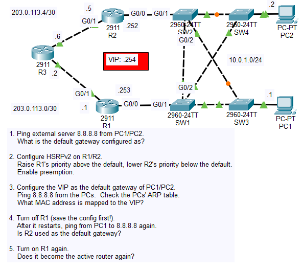
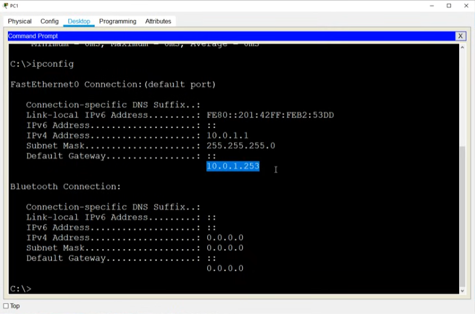
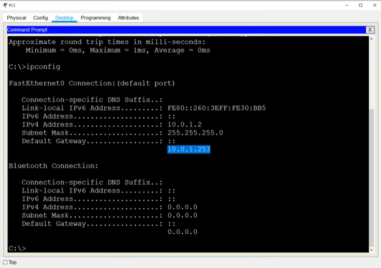
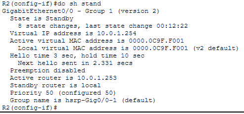
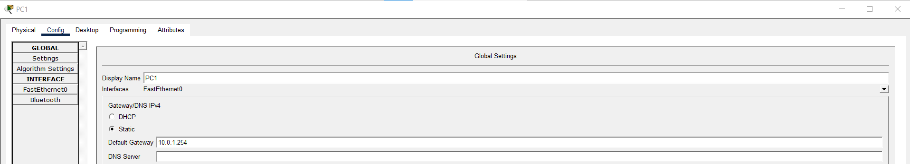
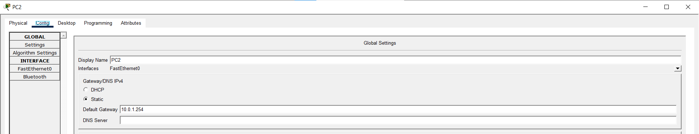
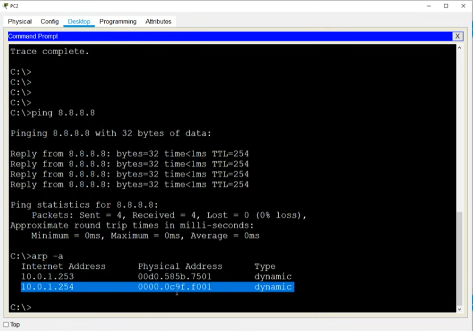
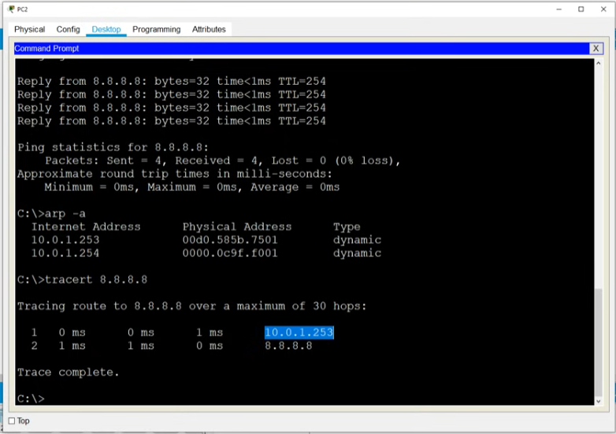
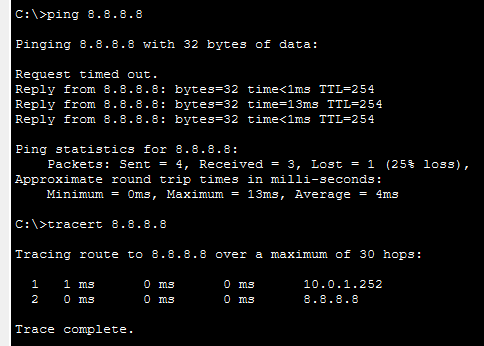
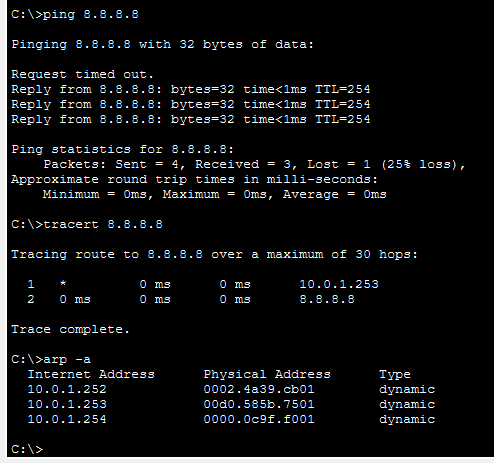

# Day 29 Lab

## Overview

Witness Hot Standby Router Protocol (HSRP) in practice and use it to provide default gateway redundancy.




## Key Activities

- Configure HSRP on 2 routers and notice that they share a virtual IP and MAC address, acting together as one virtual gateway.
- Notice the difference in configuring an active/standby router.

## Configurations

### Step 1

Ping external server 8.8.8.8 from PC1/PC2.
<br>What is the default gateway configured as?




### Step 2

Configure HSRPv2 on R1/R2.
<br>Raise R1's priority above the default, lower R2's priority below the default.
<br>Enable preemption.

```R1
R1(config)#interface gigabitEthernet 0/0

R1(config-if)#standby version 2
R1(config-if)#standby 1 ip 10.0.1.254
R1(config-if)#standby 1 priority 200
R1(config-if)#standby 1 preempt 
```

```R2
R2(config)#interface gigabitEthernet 0/0

R2(config-if)#standby version 2
R2(config-if)#standby 1 ip 10.0.1.254
R2(config-if)#standby 1 priority 50
```



### Step 3

Configure the VIP as the default gateway of PC1/PC2.
<br>Ping 8.8.8.8 from the PCs.  Check the PCs' ARP table.
<br>What MAC address is mapped to the VIP?







### Step 4

Turn off R1 (save the config first!).
<br>After it restarts, ping from PC1 to 8.8.8.8 again.
<br>Is R2 used as the default gateway?

Ping from PC1 to 8.8.8.8 while R1 is down.



### Step 5

Turn on R1 again.
<br>Does it become the active router again?

Ping from PC1 to 8.8.8.8 while R1 is up again.



Source: https://www.youtube.com/watch?v=uho5Z2nFhb8&list=PLxbwE86jKRgMpuZuLBivzlM8s2Dk5lXBQ&index=60