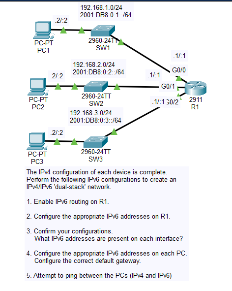
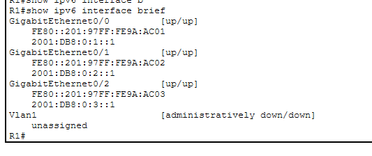
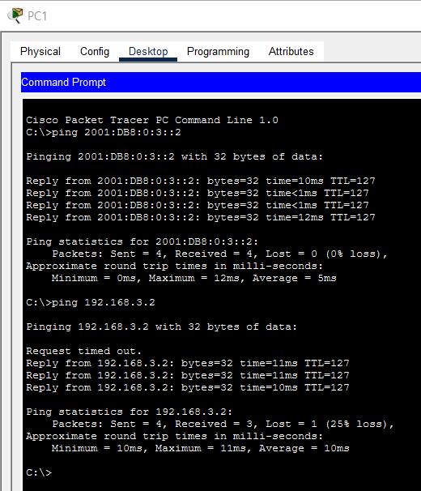
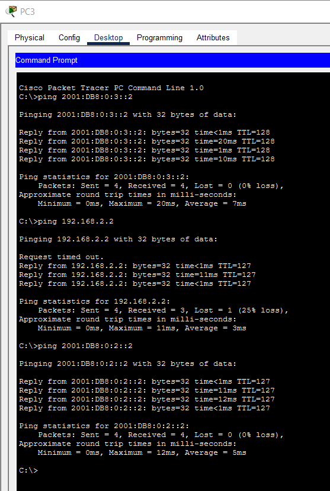

# Day 31 Lab

## Overview

Configuring a basic IPv4/IPv6 dual-stack network.



## Key Activities

- Configure IPv6 addresses and check connectivity.

## Configurations

### Step 1

Enable IPv6 routing on R1.

```R1
R1(config)#ipv6 unicast-routing 
```

### Step 2

Configure the appropriate IPv6 addresses on R1.

```R1
R1(config)#interface gigabitEthernet 0/0
R1(config-if)#ipv6 address 2001:DB8:0:1::1/64

R1(config)#interface gigabitEthernet 0/1
R1(config-if)#ipv6 address 2001:DB8:0:2::1/64

R1(config)#interface gigabitEthernet 0/2
R1(config-if)#ipv6 address 2001:DB8:0:3::1/64
```

### Step 3

Confirm your configurations.
<br>What IPv6 addresses are present on each interface?



### Step 4

Configure the appropriate IPv6 addresses on each PC.
<br>Configure the correct default gateway.

```PCs
PC1 - 2001:DB8:0:1::2
Default Gateway - 2001:DB8:0:1::1

PC2 - 2001:DB8:0:2::2
Default Gateway - 2001:DB8:0:2::1

PC3 - 2001:DB8:0:3::2
Default Gateway - 2001:DB8:0:3::1
```

### Step 5

Attempt to ping between the PCs (IPv4 and IPv6)




Source: https://www.youtube.com/watch?v=BdsIahtrWIA&list=PLxbwE86jKRgMpuZuLBivzlM8s2Dk5lXBQ&index=64