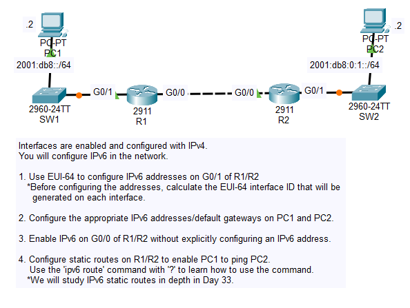
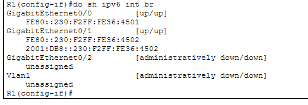
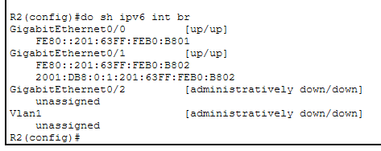
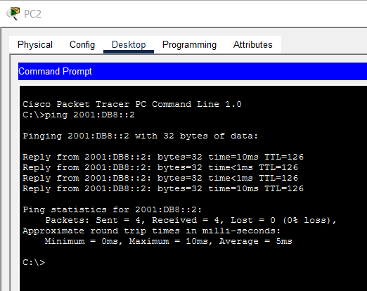

# Day 32 Lab

## Overview

More basic IPv6 configurations.



## Key Activities

- Observe how EUI-64 generates IPv6 addresses based on interface MAC addresses. 
- Observe link local addresses configure automatically on every IPv6 interface. Note that they are not routeable and helpful mainly for communication on the same local link.

## Configurations

### Step 1

Use EUI-64 to configure IPv6 addresses on G0/1 of R1/R2
<br>*Before configuring the addresses, calculate the EUI-64 interface ID that will be generated on each interface.

```R1
MAC: 0030.f236.4502

Split in half: 0030.f2 36.4502

Insert "fffe" in the middle: 0030.f2ff fe36.4502

Invert the 7th bit in first half: 0230.f2ff.fe36.4502

Add the network prefix: 2001:db8::0230:f2ff:fe36:4502/64

IPv6 Address: 2001:DB8::230:F2FF:FE36:4502

R1(config)#ipv6 unicast-routing

R1(config)#interface gigabitEthernet 0/1
R1(config-if)#ipv6 address 2001:DB8::/64 eui-64
```



```R2
MAC: 0001.63b0.b802

Split in half: 0001.63 b0.b802

Insert "fffe" in the middle: 0001.63ff feb0.b802

Invert the 7th bit in first half: 0201.63ff.feb0.b802

Add the network prefix: 2001:db8:0:1:0201:63ff:feb0:b802/64

IPv6 Address: 2001:DB8:0:1:201:63FF:FEB0:B802

R2(config)#ipv6 unicast-routing

R2(config)#interface gigabitEthernet 0/1
R2(config-if)#ipv6 address 2001:DB8:0:1::/64 eui-64
```



### Step 2

Configure the appropriate IPv6 addresses/default gateways on PC1 and PC2.

```PC1
IP ADDRESS: 2001:DB8::2
DEFAULT GATEWAY: 2001:DB8::230:F2FF:FE36:4502
```

```PC2
IP ADDRESS: 2001:DB8:0:1::2
DEFAULT GATEWAY: 2001:DB8:0:1:201:63FF:FEB0:B802
```

### Step 3

Enable IPv6 on G0/0 of R1/R2 without explicitly configuring an IPv6 address.

```R1
R1(config)#interface gigabitEthernet 0/0
R1(config-if)#ipv6 enable 
```

```R2
R2(config)#interface gigabitEthernet 0/0
R2(config-if)#ipv6 enable 
```

### Step 4

Configure static routes on R1/R2 to enable PC1 to ping PC2.
<br>Use the 'ipv6 route' command with '?' to learn how to use the command.
<br>*We will study IPv6 static routes in depth in Day 33.

```R1
R2(config)#ipv6 route 2001:db8:0:1::/64 g0/0 FE80::201:63FF:FEB0:B801
```

```R2
R2(config)#ipv6 route 2001:db8::/64 g0/0 FE80::230:F2FF:FE36:4501
```



Source: https://www.youtube.com/watch?v=Zfhpd7dl6QI&list=PLxbwE86jKRgMpuZuLBivzlM8s2Dk5lXBQ&index=66