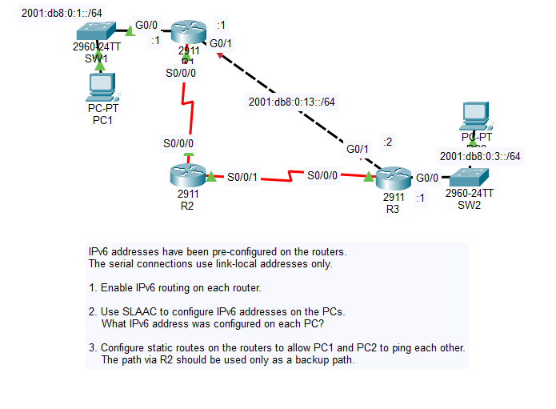
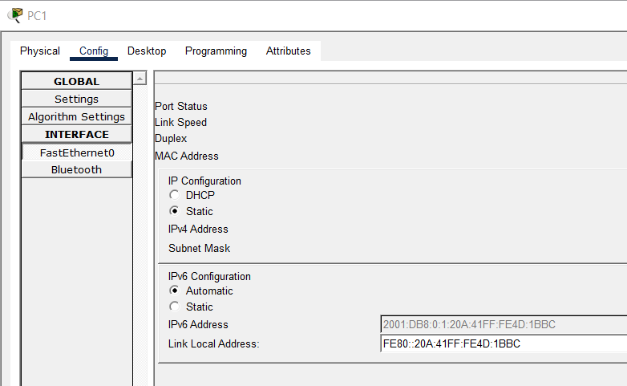
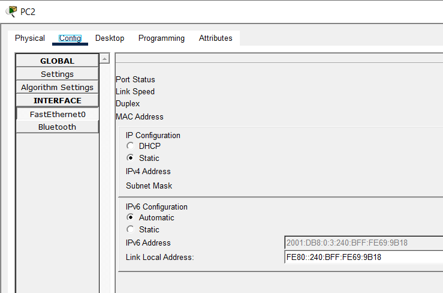
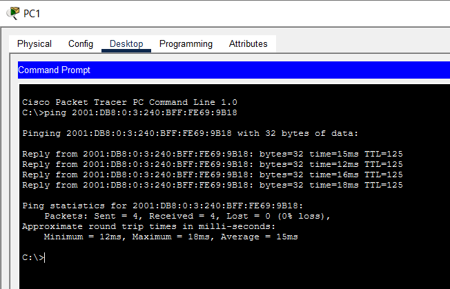
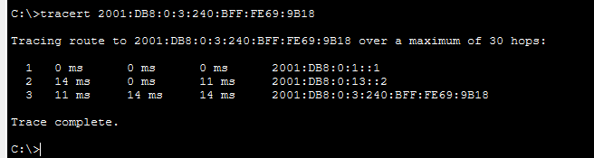
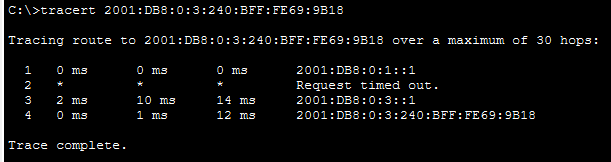

# Day 33 Lab

## Overview

Configuring IPv6 static routes.



## Key Activities

- Configure IPv6 static routes, with one designated as backup/floating.
- Observe how SLAAC can generate IPv6 addresses without a DHCP server.

## Configurations

### Step 1

Enable IPv6 routing on each router.

```Each router
R(config)#ipv6 unicast-routing 
```

### Step 2

Use SLAAC to configure IPv6 addresses on the PCs.
<br>What IPv6 address was configured on each PC?




### Step 3

Configure static routes on the routers to allow PC1 and PC2 to ping each other.
<br>The path via R2 should be used only as a backup path.

```R1
R1(config)#ipv6 route 2001:DB8:0:3::/64 GigabitEthernet0/1 2001:DB8:0:13::2
R1(config)#ipv6 route 2001:DB8:0:3::/64 Serial0/0/0 FE80::20B:BEFF:FED7:4901 5
```

```R2
R2(config)#ipv6 route 2001:DB8:0:1::/64 Serial0/0/0 FE80::202:4AFF:FE23:E201
R2(config)#ipv6 route 2001:DB8:0:3::/64 Serial0/0/1 FE80::202:4AFF:FE23:E201
```

```R3
R3(config)#ipv6 route 2001:DB8:0:1::/64 GigabitEthernet0/1 2001:DB8:0:13::1
R3(config)#ipv6 route 2001:DB8:0:1::/64 Serial0/0/0 FE80::290:2BFF:FECC:A101 5
```



With G0/1 up:



With G0/1 down:



Source: https://www.youtube.com/watch?v=WSBEVFANMmc&list=PLxbwE86jKRgMpuZuLBivzlM8s2Dk5lXBQ&index=68