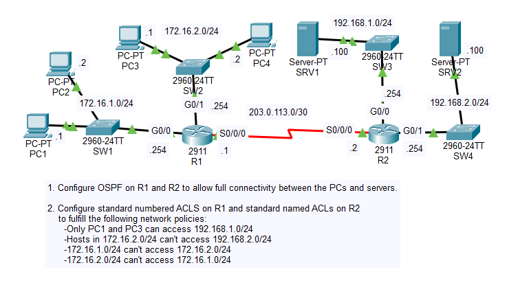
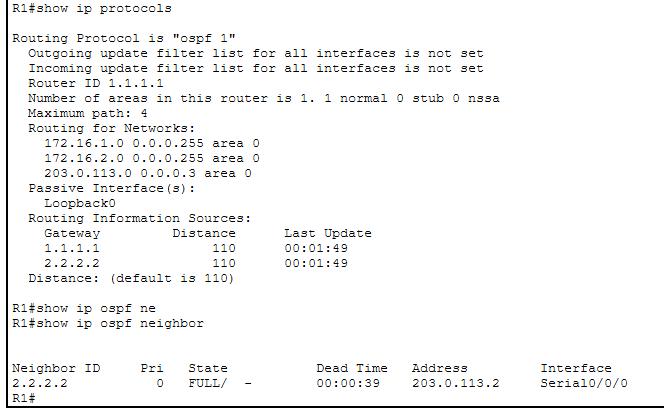
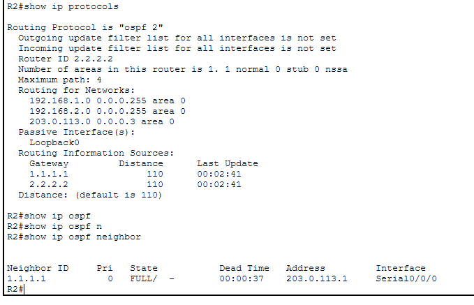
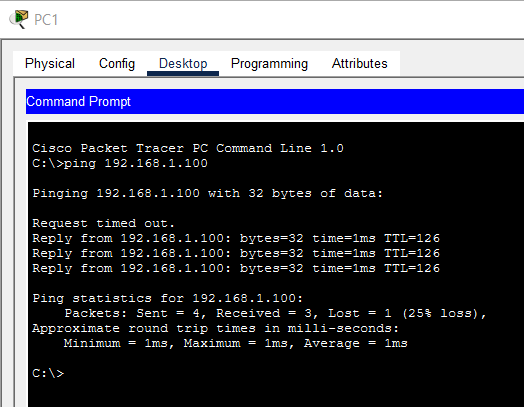
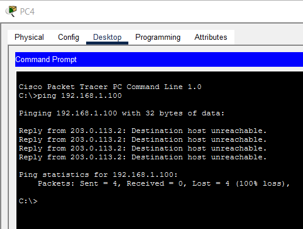
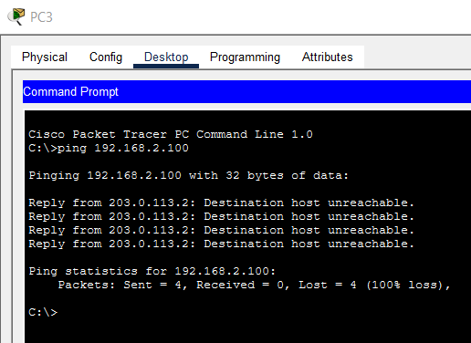
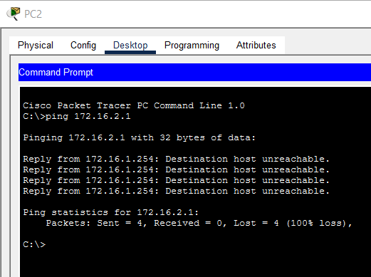
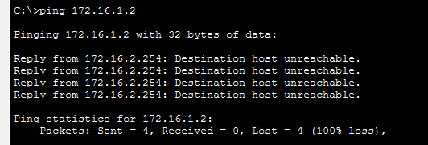

# Day 34 Lab

## Overview

Learn basic standard Access Control List (ACL) configuration.



## Key Activities

- Note that ACLs are configured per interface, as close to the destination as possible.
- Note the existence of the `implicit deny` rule.
- Differentiate between named and numbered ACLs.

## Configurations

### Step 1

Configure OSPF on R1 and R2 to allow full connectivity between the PCs and servers.

```R1
R1(config)#router ospf 1
R1(config-router)#network 172.16.0.0 0.0.255.255 area 0
R1(config-router)#network 203.0.113.0 0.0.0.3 area 0
```



```R2
R2(config)#router ospf 1
R2(config-router)#network 192.168.0.0 0.0.255.255 area 0
R2(config-router)#network 203.0.113.0 0.0.0.3 area 0
```



### Step 2

Configure standard numbered ACLS on R1 and standard named ACLs on R2 to fulfill the following network policies:
- Only PC1 and PC3 can access 192.168.1.0/24

```R2
R2(config)#ip access-list standard TO_192.168.1.0/24
R2(config-std-nacl)#permit host 172.16.1.1
R2(config-std-nacl)#permit host 172.16.2.1
R2(config-std-nacl)#deny any

R2(config)#interface GigabitEthernet0/0
R2(config-if)#ip access-group TO_192.168.1.0/24 out
```

PC1 pings SRV1



PC4 pings SRV1



- Hosts in 172.16.2.0/24 can't access 192.168.2.0/24

```R2
R2(config)#ip access-list standard TO_192.168.2.0/24
R2(config-std-nacl)#deny 172.16.2.0 0.0.0.255
R2(config-std-nacl)#permit any

R2(config)#interface GigabitEthernet0/1
R2(config-if)#ip access-group TO_192.168.2.0/24 out
```

PC3 pings SRV2



- 172.16.1.0/24 can't access 172.16.2.0/24

```R1
R1(config)#access-list 1 deny 172.16.1.0 0.0.0.255
R1(config)#access-list 1 permit any

R1(config)#interface GigabitEthernet0/1
R1(config-if)#ip access-group 1 out
```

PC2 pings PC3



- 172.16.2.0/24 can't access 172.16.1.0/24

```R1
R1(config)#access-list 2 deny 172.16.2.0 0.0.0.255
R1(config)#access-list 2 permit any

R1(config)#interface GigabitEthernet0/0
R1(config-if)#ip access-group 2 out
```

PC3 pings PC2



Source: https://www.youtube.com/watch?v=sJ8PXmiAkvs&list=PLxbwE86jKRgMpuZuLBivzlM8s2Dk5lXBQ&index=70