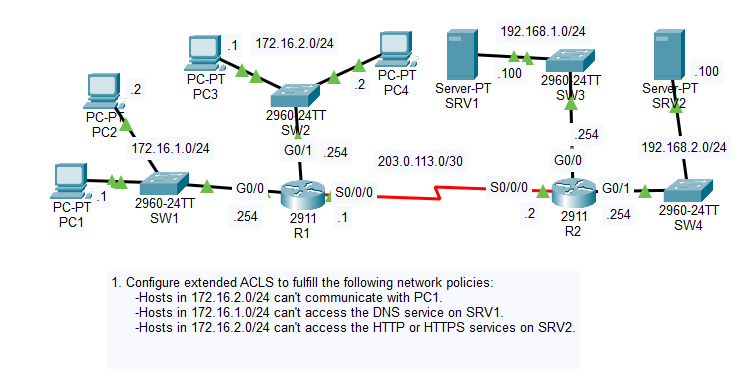
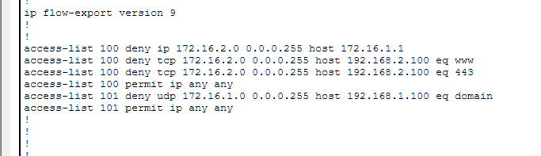
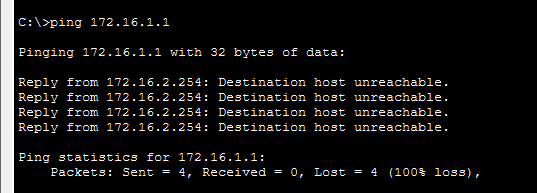
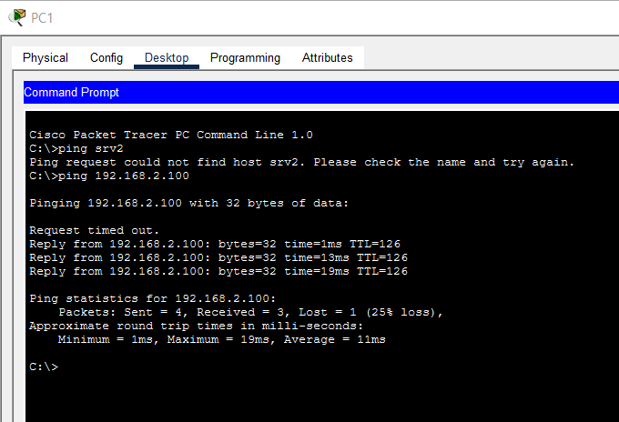
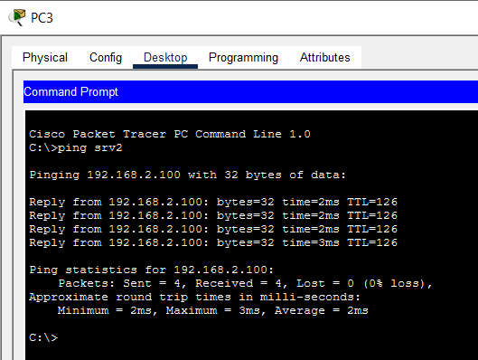
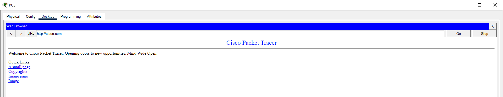
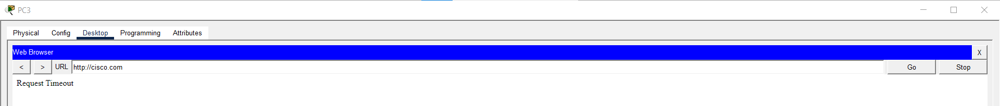

# Day 35 Lab

## Overview

Learn extended Access Control List (ACL) configuration.



## Key Activities

- Learn the syntax for confiuring extended ACLs
- Note that ACL rules are executed in a top-down fashion (from first to last added - `show running-config` is very helpful for troubleshooting)



## Configurations

### Step 1

Configure extended ACLs to fulfill the following network policies:
- Hosts in 172.16.2.0/24 can't communicate with PC1.

```R1
R1(config)#ip access-list extended 100
R1(config-ext-nacl)#deny udp 172.16.2.0 0.0.0.255 host 172.16.1.1
R1(config-ext-nacl)#permit ip any any

R1(config)#interface GigabitEthernet0/1
R1(config-if)#ip access-group 100 in
```

PC4 pings PC1



- Hosts in 172.16.1.0/24 can't access the DNS service on SRV1.

```R1
R1(config)#ip access-list extended 101
R1(config-ext-nacl)#deny udp 172.16.1.0 0.0.0.255 host 192.168.1.100 eq 53
R1(config-ext-nacl)#deny tcp 172.16.1.0 0.0.0.255 host 192.168.1.100 eq 53
R1(config-ext-nacl)#permit ip any any

R1(config)#interface GigabitEthernet0/0
R1(config-if)#ip access-group 101 in
```

Ping from PC1 to SRV2



Ping from PC3 to SRV2



- Hosts in 172.16.2.0/24 can't access the HTTP or HTTPS services on SRV2.

```R1
R1(config)#ip access-list extended 100
R1(config-ext-nacl)#deny tcp 172.16.2.0 0.0.0.255 host 192.168.2.100 eq 80
R1(config-ext-nacl)#deny tcp 172.16.2.0 0.0.0.255 host 192.168.2.100 eq 443
R1(config-ext-nacl)#permit ip any any

R1(config)#interface GigabitEthernet0/1
R1(config-if)#ip access-group 100 in
```

PC3 tries reaching the preconfigured HTTP server on SRV2 before and after applying the ACL





Source: https://www.youtube.com/watch?v=1cuMzWBrEYs&list=PLxbwE86jKRgMpuZuLBivzlM8s2Dk5lXBQ&index=72