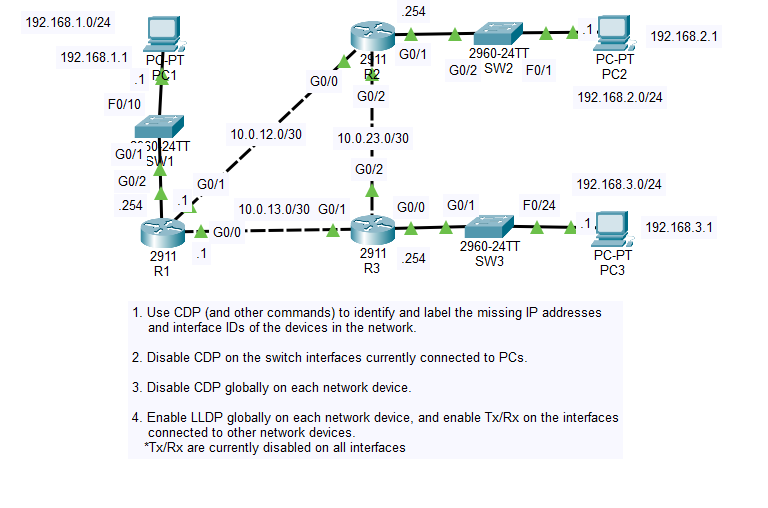
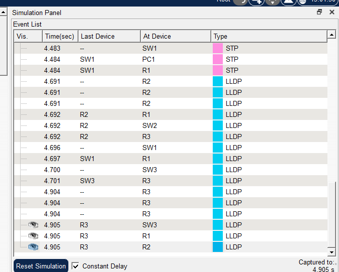

# Day 36 Lab

## Overview

Observe and configure **CDP** (Cisco Discovery Protocol) and **LLDP** (Link Layer Discovery Protocol), two Layer 2 neighbor discovery protocols.



## Key Activities

- Note the usefulness of `show cdp neighbors` and `show cdp interface`.
- Observe how Layer 2 neighbor discovery can be used to find useful information about neighbors without needing console access to them.

## Configurations

### Step 1

Use CDP (and other commands) to identify and label the missing IP addresses and interface IDs of the devices in the network.

`show cdp neighbors` - Displays interface IDs for connected cables.

`show interfaces` - Displays the IPs and subnet masks for the interfaces.

### Step 2

Disable CDP on the switch interfaces currently connected to PCs.

`show interfaces status` - shows which interfaces are connected. Since the number of connected PCs is limited, this narrows down the interfaces to the one the PCs are using.

```SW1
SW1(config)#int f0/10
SW1(config-if)#no cdp enable
```

```SW2
SW2(config)#int f0/1
SW2(config-if)#no cdp enable
```

```SW3
SW3(config)#int f0/24
SW3(config-if)#no cdp enable
```

### Step 3

Disable CDP globally on each network device.

On each network device:

```
DEVICE(config)#no cdp run
```

### Step 4

Enable LLDP globally on each network device, and enable Tx/Rx on the interfaces connected to other network devices.
<br>*Tx/Rx are currently disabled on all interfaces

```SW1
SW1(config)#lldp run

SW1(config)#int g0/1
SW1(config-if)#lldp transmit
SW1(config-if)#lldp receive
```

```SW2
SW2(config)#lldp run

SW2(config)#int g0/2
SW2(config-if)#lldp transmit
SW2(config-if)#lldp receive
```

```SW3
SW3(config)#lldp run

SW3(config)#int g0/1
SW3(config-if)#lldp transmit
SW3(config-if)#lldp receive
```

```R1
R1(config)#lldp run

R1(config)#int range g0/0 - 2
R1(config-if-range)#lldp transmit
R1(config-if-range)#lldp receive
```

```R2
R2(config)#lldp run

R2(config)#int range g0/0 - 2
R2(config-if-range)#lldp transmit
R2(config-if-range)#lldp receive
```

```R3
R3(config)#lldp run

R3(config)#int range g0/0 - 2
R3(config-if-range)#lldp transmit
R3(config-if-range)#lldp receive
```



Source: https://www.youtube.com/watch?v=4s8qqL7R9W8&list=PLxbwE86jKRgMpuZuLBivzlM8s2Dk5lXBQ&index=74