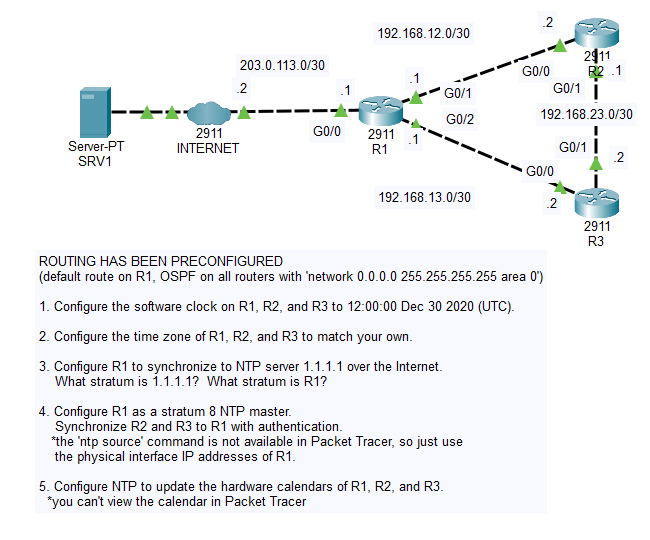
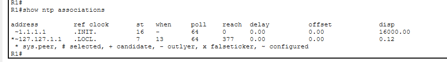
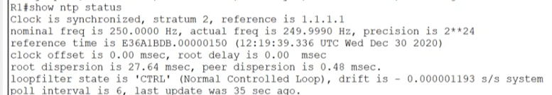
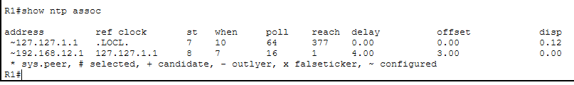

# Day 37 Lab

## Overview

Observe the **Network Time Protocol** (NTP) in action.



## Key Activities

- Observe the relationship between NTP servers and clients.
- Observe the stratum hierarchy, i.e. Stratum 0 -> Atomic clock, Stratum 1+ -> syncs from lower strata

## Configurations

### Step 1

Configure the software clock on R1, R2, and R3 to 12:00:00 Dec 30 2020 (UTC).

All routers:

```
Router#clock set 12:00:00 Dec 30 2020
```

### Step 2

Configure the time zone of R1, R2, and R3 to match your own.

All routers:

```
Router(config)#clock timezone BUC 3
```

### Step 3

Configure R1 to synchronize to NTP server 1.1.1.1 over the Internet.
<br>What stratum is 1.1.1.1?  What stratum is R1?

```R1
R1(config)#ntp server 1.1.1.1
```

`show ntp associations`



`show ntp status`



### Step 4

Configure R1 as a stratum 8 NTP master.
<br>Synchronize R2 and R3 to R1 with authentication.
<br>*the 'ntp source' command is not available in Packet Tracer, so just use the physical interface IP addresses of R1.

```R1
R1(config)#ntp master
R1(config)#ntp authenticate
R1(config)#ntp authentication-key 1 md5 jeremysitlab
R1(config)#ntp trusted-key 1
R1(config)#ntp server 192.168.12.1 key 1
```



### Step 5

Configure NTP to update the hardware calendars of R1, R2, and R3.
<br>*you can't view the calendar in Packet Tracer

All routers:

```
Router(config)#ntp update-calendar
```

Source: https://www.youtube.com/watch?v=Miys7Ft9wWI&list=PLxbwE86jKRgMpuZuLBivzlM8s2Dk5lXBQ&index=76