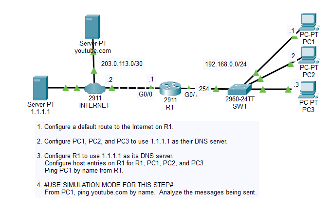
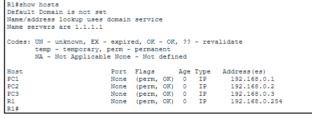
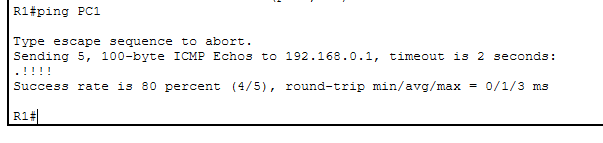
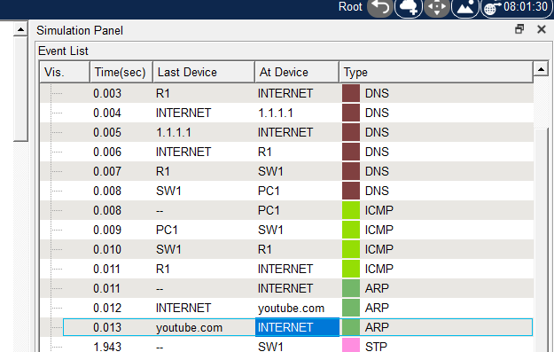

# Day 38 Lab

## Overview

Observe basic DNS configurations and traffic.



## Key Activities

- Configure a DNS server.
- Observe how DNS traffic resolves hostnames to IPs, and then ARP resolves IPs to MAC addresses.

## Configurations

### Step 1

Configure a default route to the Internet on R1.

```R1
R1(config)#ip route 0.0.0.0 0.0.0.0 203.0.113.2
```

### Step 2

Configure PC1, PC2, and PC3 to use 1.1.1.1 as their DNS server.

Each PC, under `Config` > `Settings` > `DNS Server`:

```
1.1.1.1
```

### Step 3

Configure R1 to use 1.1.1.1 as its DNS server.
<br>Configure host entries on R1 for R1, PC1, PC2, and PC3.
<br>Ping PC1 by name from R1.

```
R1(config)#ip name-server 1.1.1.1
R1(config)#ip host R1 192.168.0.254 
R1(config)#ip host PC1 192.168.0.1 
R1(config)#ip host PC2 192.168.0.2 
R1(config)#ip host PC3 192.168.0.3 
```

`show hosts`



`ping PC1`



### Step 4

#USE SIMULATION MODE FOR THIS STEP#
<br>From PC1, ping youtube.com by name.  Analyze the messages being sent.



Source: https://www.youtube.com/watch?v=7D_FapNrRUM&list=PLxbwE86jKRgMpuZuLBivzlM8s2Dk5lXBQ&index=78