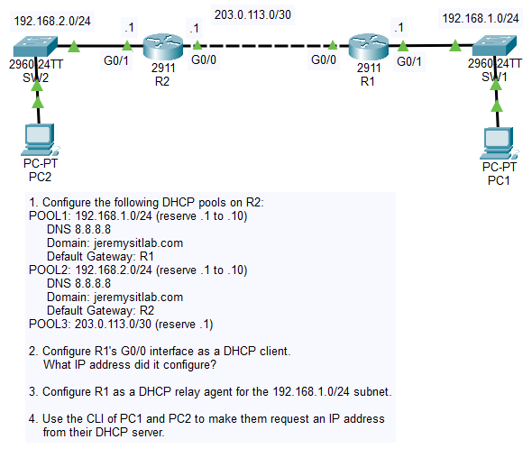
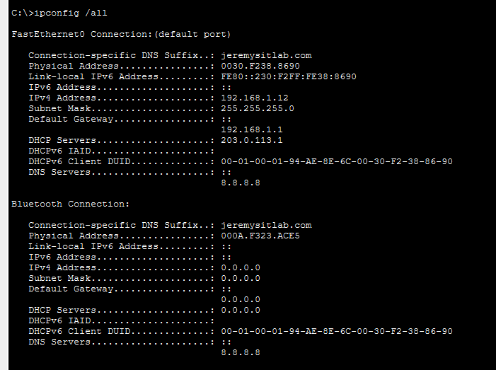
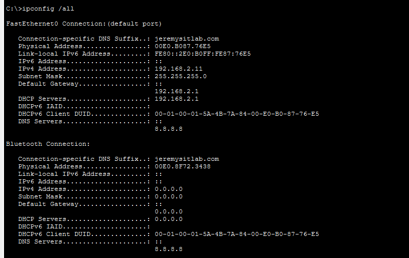
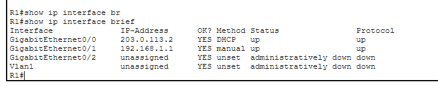
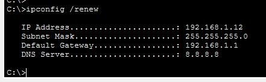
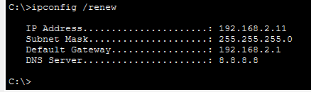

# Day 39 Lab

## Overview

Configure basic DHCP.



## Key Activities

- Configure DHCP pools per subnet
- Configure a DHCP helper address to allow DHCP requests to be forwarded between different networks

## Configurations

### Step 1

Configure the following DHCP pools on R2:

<br>POOL1: 192.168.1.0/24 (reserve .1 to .10)
- DNS 8.8.8.8
- Domain: jeremysitlab.com
- Default Gateway: R1

```R2
R2(config)#ip dhcp excluded-address 192.168.1.1 192.168.1.10

R2(config)#ip dhcp pool POOL1

R2(dhcp-config)#network 192.168.1.0 255.255.255.0
R2(dhcp-config)#default-router 192.168.1.1
R2(dhcp-config)#dns-server 8.8.8.8
R2(dhcp-config)#domain-name jeremysitlab.com
```

POOL2: 192.168.2.0/24 (reserve .1 to .10)
- DNS 8.8.8.8
- Domain: jeremysitlab.com
- Default Gateway: R2

```R2
R2(config)#ip dhcp excluded-address 192.168.2.1 192.168.2.10

R2(config)#ip dhcp pool POOL2

R2(dhcp-config)#network 192.168.2.0 255.255.255.0
R2(dhcp-config)#default-router 192.168.2.1
R2(dhcp-config)#dns-server 8.8.8.8
R2(dhcp-config)#domain-name jeremysitlab.com
```

POOL3: 203.0.113.0/30 (reserve .1)

```R2
R2(config)#ip dhcp excluded-address 203.0.113.1

R2(config)#ip dhcp pool POOL3
R2(dhcp-config)#network 203.0.113.0 255.255.255.252
```

PC1 DHCP config:



PC2 DHCP config:



### Step 2

Configure R1's G0/0 interface as a DHCP client.
<br>What IP address did it configure?

```R1
R1(config)#int g0/0
R1(config-if)#ip address dhcp
R1(config-if)#no shutdown
```



### Step 3

Configure R1 as a DHCP relay agent for the 192.168.1.0/24 subnet.

```R1
R1(config)#interface GigabitEthernet0/1
R1(config-if)#ip helper-address 203.0.113.1
```

### Step 4

Use the CLI of PC1 and PC2 to make them request an IP address from their DHCP server.

PC1 renews DHCP configuration:



PC2 renews DHCP configuration:



Source: https://www.youtube.com/watch?v=cgMsoIQB9Wk&list=PLxbwE86jKRgMpuZuLBivzlM8s2Dk5lXBQ&index=80