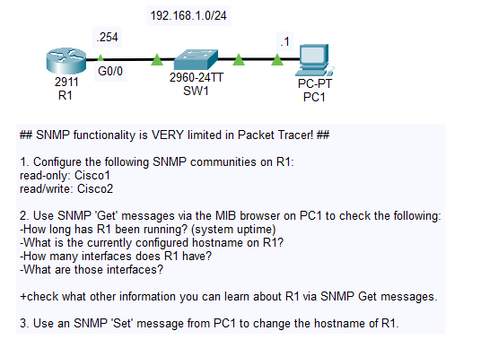
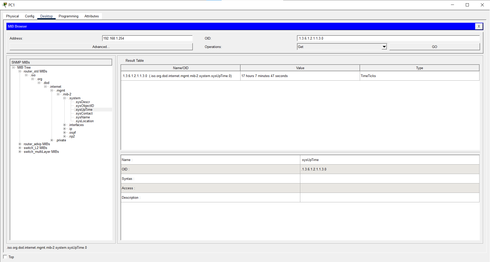
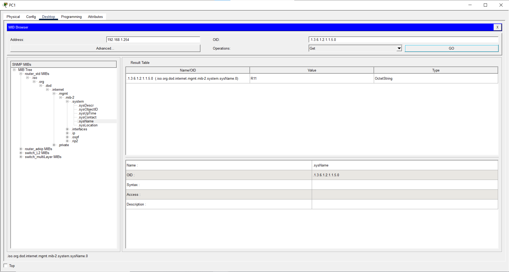
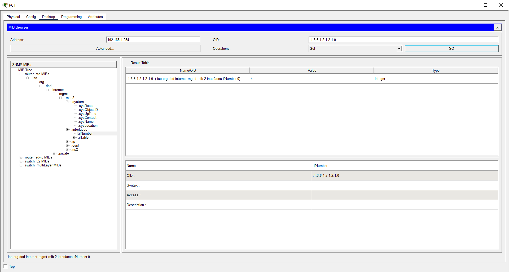
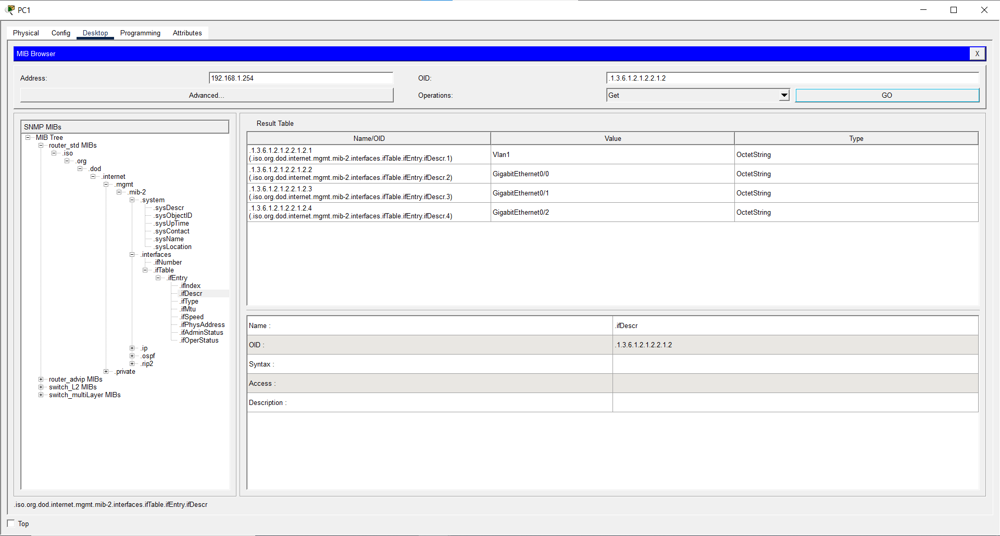
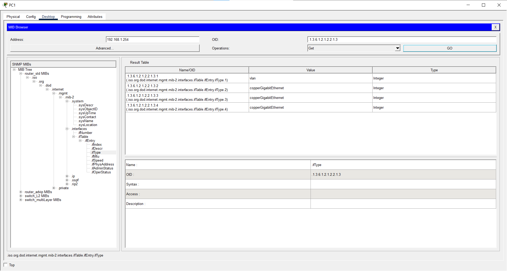
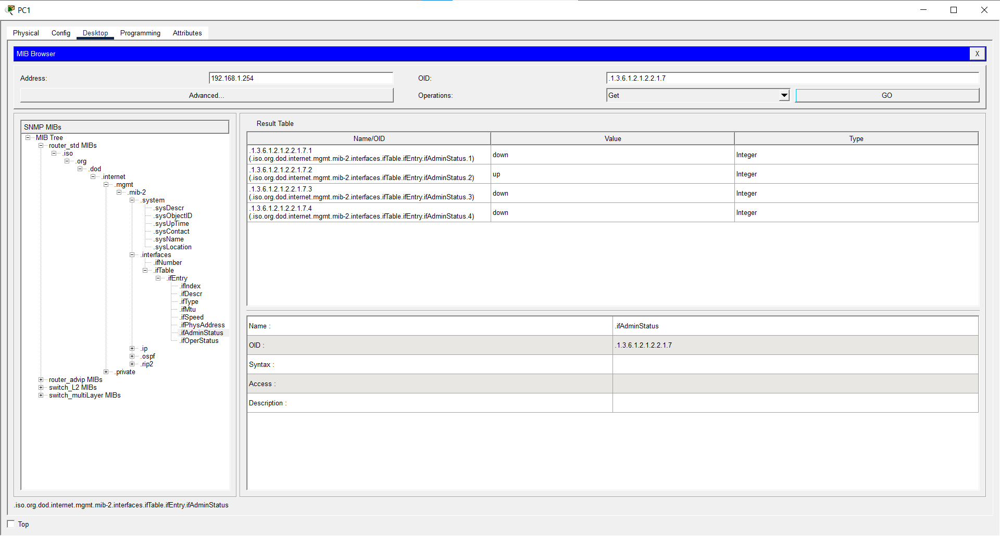
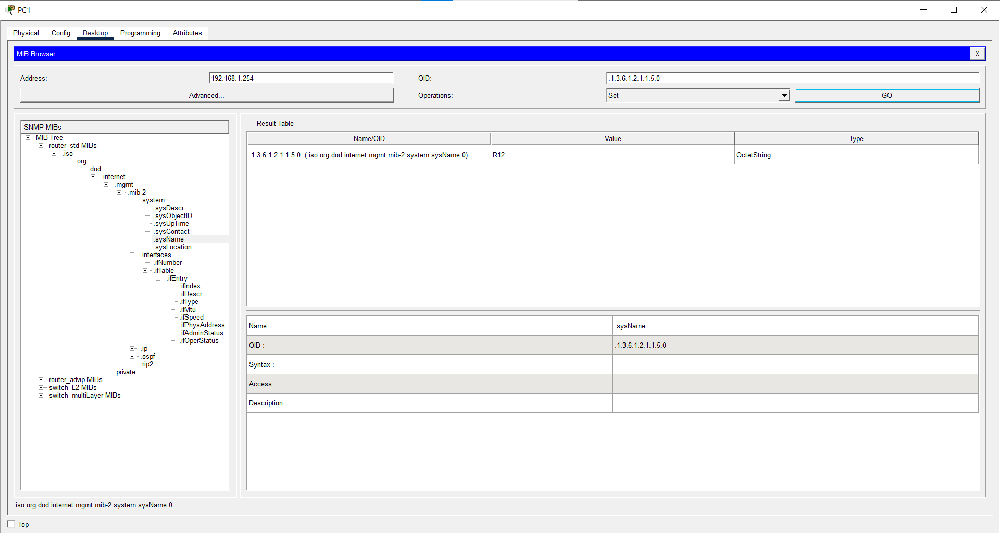

# Day 40 Lab

## Overview

Observe basic **Simple Network Management Protocol** (SNMP) queries in practice.



## Key Activities

- Query the SNMP manager from an agent after setting up plaintext authentication credentials.

## Configurations

### Step 1

Configure the following SNMP communities on R1:
<br>read-only: Cisco1
<br>read/write: Cisco2

```R1
R1(config)#snmp-server community Cisco1 RO
R1(config)#snmp-server community Cisco2 RW
```

### Step 2

Use SNMP 'Get' messages via the MIB browser on PC1 to check the following:
- How long has R1 been running? (system uptime)



- What is the currently configured hostname on R1?



- How many interfaces does R1 have?



- What are those interfaces?



`+` check what other information you can learn about R1 via SNMP Get messages.





### Step 3

Use an SNMP 'Set' message from PC1 to change the hostname of R1.



Source: https://www.youtube.com/watch?v=v8WxIytUdS4&list=PLxbwE86jKRgMpuZuLBivzlM8s2Dk5lXBQ&index=82