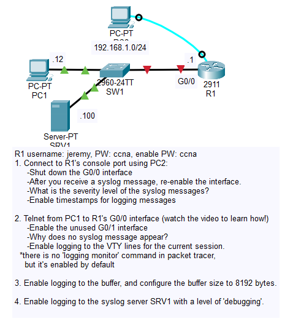
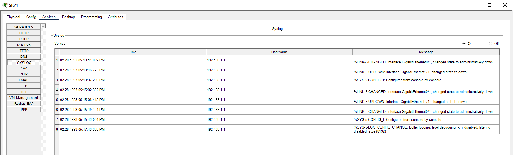

# Day 41 Lab

## Overview

Get a surface level overview of how to configure and use **syslog**.



## Key Activities

- Tweak **syslog** configurations.
- Forward **syslog** logs to a server.

## Configurations

### Step 1

Connect to R1's console port (default settings) using PC2:
- Shut down the G0/0 interface
- After you receive a syslog message, re-enable the interface.
- What is the severity level of the syslog messages?

```syslog
%LINK-5-CHANGED: Interface GigabitEthernet0/0, changed state to administratively down
%LINEPROTO-5-UPDOWN: Line protocol on Interface GigabitEthernet0/0, changed state to down
```

```syslog
%LINK-5-CHANGED: Interface GigabitEthernet0/0, changed state to up
%LINEPROTO-5-UPDOWN: Line protocol on Interface GigabitEthernet0/0, changed state to up
```

Answer: Severity 5

- Enable timestamps for logging messages

```R1
R1(config)#service timestamps log datetime msec 
```

### Step 2

Telnet from PC1 to R1's G0/0 interface (watch the video to learn how!)
- Enable the unused G0/1 interface
- Why does no syslog message appear?

Logging is currently disabled.

- Enable logging to the VTY lines for the current session.
<br>*there is no 'logging monitor' command in packet tracer, but it's enabled by default

```R1
R1#terminal monitor 
```

### Step 3

Enable logging to the buffer, and configure the buffer size to 8192 bytes.

```R1
R1(config)#logging buffered 8192
```

```R1
R1#show logging
```

```syslog
Syslog logging: enabled (0 messages dropped, 0 messages rate-limited,
          0 flushes, 0 overruns, xml disabled, filtering disabled)

No Active Message Discriminator.


No Inactive Message Discriminator.


    Console logging: level debugging, 16 messages logged, xml disabled,
          filtering disabled
    Monitor logging: level debugging, 5 messages logged, xml disabled,
          filtering disabled
    Buffer logging:  level debugging, 0 messages logged, xml disabled,
          filtering disabled

    Logging Exception size (8192 bytes) 
    Count and timestamp logging messages: disabled
    Persistent logging: disabled

No active filter modules.

ESM: 0 messages dropped
    Trap logging: level informational, 16 message lines logged
        Logging to 192.168.1.100  (udp port 514,  audit disabled,
             authentication disabled, encryption disabled, link up),
             16 message lines logged,
             0 message lines rate-limited,
             0 message lines dropped-by-MD,
             xml disabled, sequence number disabled
             filtering disabled

Log Buffer (8192 bytes):
...
```

### Step 4

Enable logging to the syslog server SRV1 with a level of 'debugging'.

```R1
R1(config)#logging host 192.168.1.100
R1(config)#logging trap debugging
```



Source: https://www.youtube.com/watch?v=-R_CYM6Wm-Y&list=PLxbwE86jKRgMpuZuLBivzlM8s2Dk5lXBQ&index=84