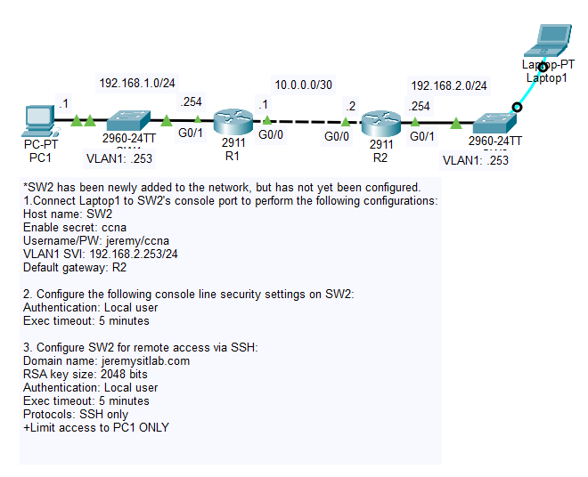

# Day 42 Lab

## Overview

Learn to configure and restrict logins to SSH.



## Key Activities

- Configure SSH login via console/vty lines.
- Restrict host logins with ACLs and protocol login directly on the vty lines.

## Configurations

### Step 1

Connect Laptop1 to SW2's console port to perform the following configurations:
- Host name: SW2
- Enable secret: ccna
- Username/PW: jeremy/ccna
- VLAN1 SVI: 192.168.2.253/24
- Default gateway: R2

```SW2
Switch(config)#hostname SW2

SW2(config)#enable secret ccna
SW2(config)#username jeremy secret ccna

SW2(config)#int vlan 1
SW2(config-if)#ip add 192.168.2.253 255.255.255.0
SW2(config-if)#no shutdown

SW2(config)#ip default-gateway 192.168.2.254
```

### Step 2

Configure the following console line security settings on SW2:
- Authentication: Local user
- Exec timeout: 5 minutes

```SW2
SW2(config)#line console 0
SW2(config-line)#login local
SW2(config-line)#exec-timeout 5
```

### Step 3

Configure SW2 for remote access via SSH:
- Domain name: jeremysitlab.com
- RSA key size: 2048 bits
- Authentication: Local user
- Exec timeout: 5 minutes
- Protocols: SSH only
+ Limit access to PC1 ONLY

```SW2
SW2(config)#ip domain name jeremysitlab.com

SW2(config)#crypto key generate rsa
How many bits in the modulus [512]: 2048

SW2(config)#access-list 1 permit host 192.168.1.1

SW2(config)#line vty 0 15
SW2(config-line)#login local
SW2(config-line)#exec-timeout 5
SW2(config-line)#transport input ssh
SW2(config-line)#access-class 1 in
```

Trying to connect from R1:
```
R2#ssh -l jeremy 192.168.2.253

% Connection refused by remote host
```
```
R2#ping 192.168.2.253

Type escape sequence to abort.
Sending 5, 100-byte ICMP Echos to 192.168.2.253, timeout is 2 seconds:
!!!!!
Success rate is 100 percent (5/5), round-trip min/avg/max = 0/0/0 ms
```

Trying to connect from PC1:

```
C:\>ping 192.168.2.253

Pinging 192.168.2.253 with 32 bytes of data:

Request timed out.
Reply from 192.168.2.253: bytes=32 time<1ms TTL=253
Reply from 192.168.2.253: bytes=32 time=12ms TTL=253
Reply from 192.168.2.253: bytes=32 time=13ms TTL=253

Ping statistics for 192.168.2.253:
    Packets: Sent = 4, Received = 3, Lost = 1 (25% loss),
Approximate round trip times in milli-seconds:
    Minimum = 0ms, Maximum = 13ms, Average = 8ms
```
```
C:\>ssh -l jeremy 192.168.2.253

Password: 

SW2>
```

Source: https://www.youtube.com/watch?v=QnHq7iCOtTc&list=PLxbwE86jKRgMpuZuLBivzlM8s2Dk5lXBQ&index=86