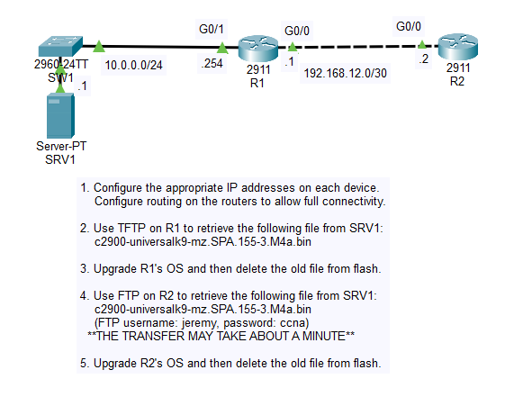
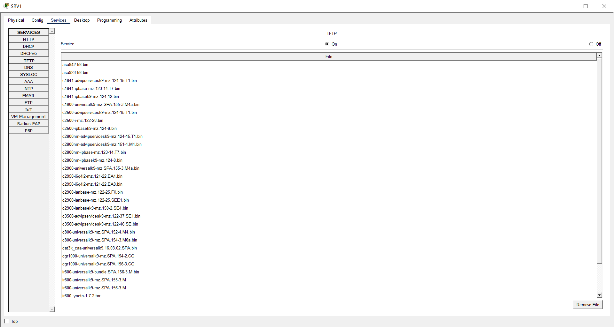
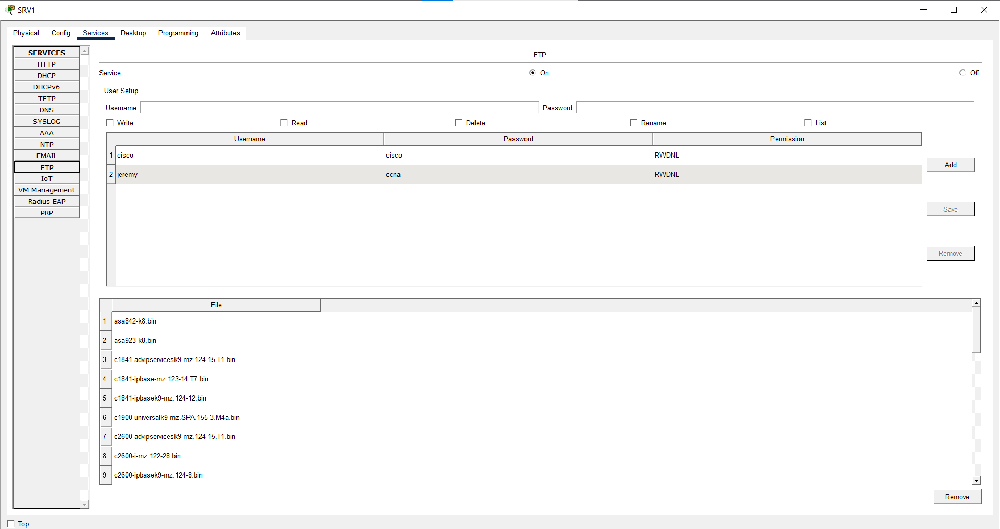
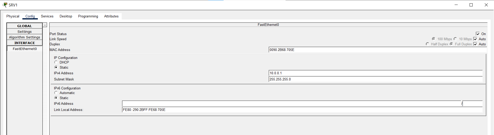
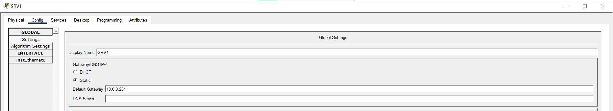

# Day 43 Lab

## Overview

Transfer files via FTP/TFTP.







## Key Activities

- Transfer binary files via FTP/TFTP and use them to update the routers' OS. 

## Configurations

### Step 1

Configure the appropriate IP addresses on each device.
<br>Configure routing on the routers to allow full connectivity.

```R1
R1(config)#interface GigabitEthernet0/0
R1(config-if)#ip address 192.168.12.1 255.255.255.252

R1(config)#interface GigabitEthernet0/1
R1(config-if)#ip address 10.0.0.254 255.255.255.0
```

```R2
R2(config)#interface GigabitEthernet0/0
R2(config-if)#ip address 192.168.12.2 255.255.255.252

R2(config)#ip route 10.0.0.0 255.255.255.0 192.168.12.1 
```





### Step 2

Use TFTP on R1 to retrieve the following file from SRV1:
<br>*c2900-universalk9-mz.SPA.155-3.M4a.bin*

```R1
R1#copy tftp flash
Address or name of remote host []? 10.0.0.1
Source filename []? c2900-universalk9-mz.SPA.155-3.M4a.bin
Destination filename [c2900-universalk9-mz.SPA.155-3.M4a.bin]?
```

### Step 3

Upgrade R1's OS and then delete the old file from flash.

```
R1(config)#boot system flash c2900-universalk9-mz.SPA.155-3.M4a.bin
R1#write
R1#reload
```
```
R1#show version
Cisco IOS Software, C2900 Software (C2900-UNIVERSALK9-M), Version 15.5(3)M4a, RELEASE SOFTWARE (fc1)
```
```
R1#delete flash:c2900-universalk9-mz.SPA.151-4.M4.bin
```
```
R1#show flash

System flash directory:
File  Length   Name/status
  4   33591768 c2900-universalk9-mz.SPA.155-3.M4a.bin
  2   28282    sigdef-category.xml
  1   227537   sigdef-default.xml
[33847587 bytes used, 221896413 available, 255744000 total]
249856K bytes of processor board System flash (Read/Write)
```

### Step 4

Use FTP on R2 to retrieve the following file from SRV1:
<br>*c2900-universalk9-mz.SPA.155-3.M4a.bin*
<br>(FTP username: jeremy, password: ccna)
<br>**THE TRANSFER MAY TAKE ABOUT A MINUTE**

```
R2(config)#ip ftp username jeremy
R2(config)#ip ftp password ccna
```

```
R2#copy ftp flash
Address or name of remote host []? 10.0.0.1
Source filename []? c2900-universalk9-mz.SPA.155-3.M4a.bin
Destination filename [c2900-universalk9-mz.SPA.155-3.M4a.bin]?
```

### Step 5

Upgrade R2's OS and then delete the old file from flash.

```
R2(config)#boot system flash c2900-universalk9-mz.SPA.155-3.M4a.bin
R2#write
R2#reload
```

```
R2#delete flash:c2900-universalk9-mz.SPA.151-4.M4.bin
```

Source: https://www.youtube.com/watch?v=W9PLvA2wZ28&list=PLxbwE86jKRgMpuZuLBivzlM8s2Dk5lXBQ&index=88